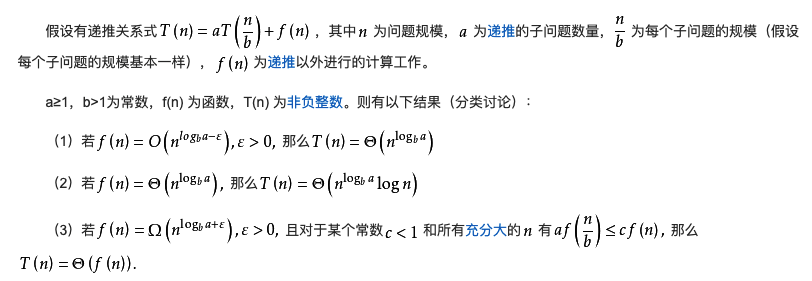
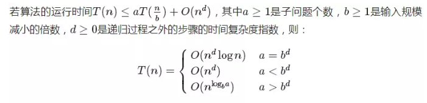

# 算法复杂度主方法
有时候,我们要评估一个算法的复杂度,但是算法被分散为几个递归的子问题,这样评估起来很难,有一个数学公式可以很快地评估出来.

## 复杂度主方法
主方法,也可以叫主定理.对于哪些用分治法,有递推关系式的算法,可以很快求出复杂度.

定义如下:

由于主定理的公式十分复杂,所以这里有一种比较简化的版本来计算:

## 举例
1. 二分搜索,每次问题规模减半,只查一个数,递推过程之外的查找复杂度为`O(1)`,递推运算时间公式为:`T(n) = T(n/2) + O(1)`.
2. 快速排序,每次随机选一个数字作为划分进行排序,每次问题规模减半,递推过程之外的排序复杂度为`O(n)`,递推运算时间递推公式为:`T(n) = 2T(n/2) + O(n)`.

按照简化版的主定理,可以知道:

二分查找:`a = 1，b = 2，d = 0`,可以知道`a = b^d`,所以二分查找的时间复杂度为:`O(logn)`.

快速排序:`a = 2，b = 2，d = 1`可以知道`a = b^d`,所以快速排序的时间复杂度为:`O(nlogn)`.

强调:并非所有递推关系式都可应用主定理,但是大部分情况下都可以.