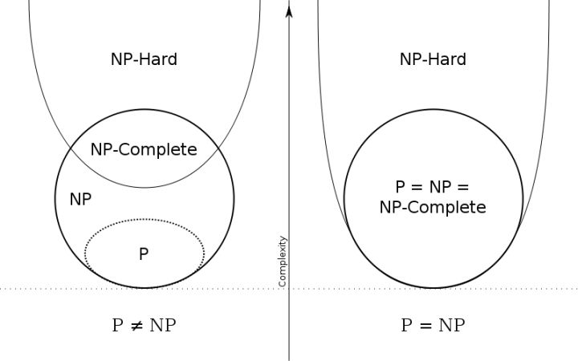

# 延申-计算理论:P和NP问题
在计算机科学中,有一个专门分支研究问题的可计算性,叫做计算理论.

我们用计算机算法来解决一个问题,如果一个问题被证明很难计算,或者只能暴力枚举来解决,那么我们就不必花大力气去质疑使用的算法是不是错了,为什么这么慢,计算怎么九都没出结果,到底有没有更好的算法.

计算机科学把一个待解决的问题分类为:`P`问题,`NP`问题,`NPC`问题,`NP-hard`问题.

## P和`NP`问题
类似于`O(1)，O(logn)，O(n)`等复杂度,规模`n`出现在底数的位置,计算机能在多项式时间解决,我们称为多项式级的复杂.

类似于`O(n!)，O(2^n)`等复杂度,规模`n`出现在顶部位置,计算机能在非多项式时间解决,我们称为非多项式级的复杂度.

如果一个问题,可以用一个算法在多项式时间内解决,它称为`P`问题(P为Polynomial缩写,多项式)

比如求1加到100的总和,它的时间复杂度是`O(n)`,是多项式时间.

然而有些问题,只能枚举的方式求解,时间复杂度是指数级别,非多项式时间,但是只有一个解,我们能在多项式时间验证这个解是对的,这类问题称为`NP`问题.

也就是说,如果我们只能靠猜出问题的一个解,然后可以用多项式时间来验证这个解,这些问题都是`NP`问题.

所以,按照定义,所有的`P`问题都是`NP`问题.

计算理论延申出了图灵机理论,自动机=算法.

有两种自动机,一种是确定性自动机,机器从一个状态到另外一个状态的变化,只有一个分支可以走,而非确定性自动机,从一个状态到另外一个状态,有多个分支可以走.`P`问题都可以用两种机器来解决,当非确定性自动机退化变成来确定性自动机,而`NP`问题只能用非确定性自动机来解决.

自动机对`N`和`NP`问题的定义:

可以在确定性自动机以多项式时间解决的问题,称为`P`问题,可以在多项式时间验证答案的问题称为`NP`问题,而`NP`问题是可以在非确定性自动机以多项式时间解决的问题(NP为Non-deterministicPolynomial的缩写,非确定多项式)

数学,计算机科学,哲学,三个学科其实交融在一起,自动机是一个假象的机器,世界其实也可以是一个假象的机器,所以世界可以等于一台自动机吗?大家可以发挥想象力,在以后的日子里慢慢体会.

## NPC和NP-hard问题
存在这样一个`NP`问题,所有的`NP`问题都可以约化成它,换句话说,只要解决了这个问题,那么所有的`NP`问题都解决了.其定义要满足2个条件:

1. 它得是一个`NP`问题
2. 所有的`NP`问题都可以约化到它

这种问题称为`NP`完全问题.按照这种定义`NP`问题要比`NPC`问题的范围广.

那什么是`NP-hard`问题,其定义要满足2个条件:

1. 所有的`NP`问题都可以约化到它
2. 它不是一个`NP`问题

也就是说,`NP-hard`问题更难,你只要解决了`NP-hard`问题,那么所有的`NP`问题都可以解决.但是,这个问题本身不是一个`NP`问题,也就是解不能再多项式时间内被验证.

比如你有一个交际网,每个人是一个节点,认识的人之间相连,你要通过一个最快,最省钱,最能提升个人形象,最没有威胁,最不影响你日常生活的方式认识另外一个人,你怎么证明你认识另外一个人是最省钱的呢?

我们一旦发现一个问题是`NPC`问题,那么我们难取准确求出其解,只能暴力枚举,靠猜.

## 总结

`P=NP`问题的目标,就是想要知道`P`和`NP`这两个集合是否相等.为了证明两个集合(A和B相等),一般都要证明两个方向:

1. A包含B
2. B包含A

我们已经说过,`NP`包含了`P`因为任何一个非确定性机器,都能被当成一个确定性的机器来用.你只要不使用它的"超能力",在每个分支点只探索一条路径就行.

所以`P=NP`就在于`P`是否也包含了`NP`.也就是所,如果只使用确定性计算机,能否在多项式时间之内,解决所有非确定性计算机能在多项式时间内解决的问题.