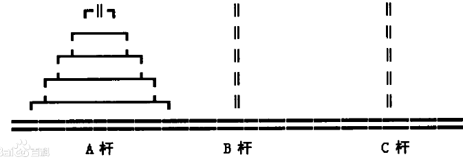

# 基础知识
## 什么是算法
算法`algorithm`表示算账的方法,也可以表示运筹帷幄的计谋等.

在计算机科技里,顾名思义是用来计算的机器,算法在计算机科学中可以描述为:计算机接收一个输入指令,然后进行一个过程处理,最后输出计算的结果

```
这种输入-过程处理-输出，用人类的行为模式，很容易理解，比如妈妈让小明去打酱油，打酱油的命令是输入，小明发现小区周边有5家店有酱油出售，娟娟超市是离家最近的，而子龙杂货店虽然离得最远，但酱油很便宜。小明为了省钱，跑到最远的子龙杂货店买了酱油，然后顺利回到了家，交给了妈妈。买酱油的过程就是处理，而给妈妈的酱油是输出。

小明为什么不去最近的娟娟超市，而去了最远的子龙杂货店，这是小明脑袋里思考后产生的最佳方案。当然，现在买酱油可以通过外卖软件，小明可以打开美团外卖软件，搜索关键字：酱油，然后点击筛选，离家最近的和最便宜的，然后选择最便宜的酱油下单。

买酱油的过程 = 美团外卖软件下单的过程。
```

如果人类真正了解人脑神经元的信息传递过程,甚至可能造出有自我意思的机器,但这种场景仍然只能在科幻电影中看到.

所以,这个逻辑过程或行为模式,在计算机里面映射的是算法.

用更准确的描述来说,算法是一种`有限\确定\有效`的并适合用计算机程序来实现的,用来解决问题的方法,首先,有一个问题,然后有一个方法去解决它,这个方法叫算法.

算法是有限的,就是算法的步骤是有限的的,执行的时间也是有限的,能够在有限时间内得出结果,算法是确定的,就是无论执行多少次,计算得出的结果都一样,算法是有效的,就是计算出的结果对解决问题有帮助

然而算法的定义一直被刷新,因为机器学习的出现,基于海量超大规模数据,机器学习算法的步骤是无限的,可以一直计算下去,每次计算的结果也不一样,但如果人为进行步骤限制,以及增加训练阈值,训练时得出的参数超过设定的阈值马上停止运算,倒也符合以上的定义.

算法要在有限的时间内完成,本身是对人类的一种负担.因为人类造出的机器还不够强.即使算法的步骤是有限的,执行的时间也可能特别长

```
正如《从一到无穷大》书中印度教圣地贝拿勒斯神庙下的三根宝石针，印度教主神焚天说过，谁可以把第一根宝石针的64块金片通过第二根宝石针移到第三根，焚天塔，神庙，婆罗门将化为灰烬，这是有名的汉诺塔算法。
```

汉诺塔问题可以描述为:
有三根杆`A,B,C`在`A`杆自下而上,由大到小按顺序放置64个金盘,游戏目标:把`A`杆上的金盘全部移到`C`杆上,并仍然保持原有顺序叠好


操作规则:每次只能移动一个盘子,并且在移动过程中三根杆上都始终保持大盘在下,小盘在上,操作过程中盘子可以置于`A,B,C`任一杆上.

我们很自然想到一个算法:

1. 我们必须先借助`C`杆,将`A`杆前面`N-1`个盘子,移动到`B`杆后,将`A`杆剩下的一个盘子,直接移动到`C`杆,这时候`A`空了

2. 然后借助`A`杆将`B`杆的`N-1`个盘子,移动到`C`杆任务就完成

编程语言hannuota.go实现

通过归纳,我们可以直到移动次数`Total(N)`的关系时`Total(N)=2*Total(N-1)+1`,没多一个盘子,移动次数就会翻倍加一,我们通过相关的数列数学方法可以直到`Total(N)=2^N-1`,也就是移动次数就是一个指数方程:2的N次方,指数等于盘子的数量.

`2^64-1=18446744073709551615`,可以直到一个人日夜不停,一秒移动一次:
`18446744073709551615/3600/24/365/100000000=5849`要5849亿年时间菜可以完成这件事.

在计算科学中,因为所有的算法都是人定义的规则,规则是死的,所以不要担心学不会...

## 什么是数据结构
数据结构,顾名思义就是存放数据的结构,也可以认为是存放数据的容器,比如:你要找出1000个数字中的最大值,首先你要将1000个数字记在某些卡片上,然后对卡片进行排序.

大多数算法都需要组织数据,所以产生了数据结果,数据结果在计算中,主要是用来实现各种算法的基础,当然数据结构本身也是算法的一部分.

基本的数据结构有:链表,栈和队列,树和图

链表:就是把数据链接起来,关联起来,一个数据节点指向另外一个数据节点,像自然界的一条条铁链,大部分数据结构,都是由链表的若干变种来表示.

在每种编程语言中,数组作为基本数据类型提供,数组是连续的内存存储空间,通过下标0,1,2可以迅速获取到数组指定位置的数据.链表也可以用数组来实现,但一般情况下,因为数组是连续的,在链表增加和删除节点时容易造成冗余,效果不佳.所以链表在不同编程语言实现是这样的`C,C++`是用指针来实现的,`Java`用类实现的,而`go`是用结构体引用来实现的

栈和队列:主要用来存储多个数据,只不过一个是先进后出,一个先进先出.比如下压栈,先入栈的数据是最后才能出来的,而我们熟知的队列,先排队的人肯定先获得服务

其次是树和图:树就是一个树根节点,存放着数据,下面有很多子节点,也存放着数据,类比自然界的树.图则可以类比自然界的地图,多个节点指向多个点,点和点之间有一条或多条边,而这些点存放着数据,边也存放着数据,比如距离

围绕这几种数据结构,有若干延申,加上一些排序,就形成了更高层次的高级数据结构

数据结构是算法实现的辅助,是为了更高效组织数据的结构,所以数据结构和算法其实密切联系,并不需要分得太清,大家可以把数据结构等同于算法

## 什么叫好的数据结构和好的算法
学习算法的原因,是好的算法可以节约资源,但是选择合适的算法很难,我们要进行复杂的数学分析才能直到,什么叫好的,在计算机里我们把数学分析这叫做算法分析

什么是好的的数据结构和好的算法?

1. 计算机资源是有限的,所以占用计算机资源越少的数据结构和算法越好

2. 人的生命是有限的,等待时间是有忍耐度的,所以能辅助程序越快完成工作的数据结构和算法越好

所以出来个理论:时间和空间算法复杂度理论

程序执行过程中,要么空间换时间,要么时间换空间,空间可以认为是一种计算机资源如内存使用情况,而时间是人类感知的第四个维度,就是慢还是快,两者一般不能兼得,如果发现居然兼得了,那就是发明了一种更好的算法

目前有一种新型的计算方式正在研究中,叫量子计算,可以在非常小的空间,使用非常少的资源,短时间内计算超级大量的数据.

## 总结
程序设计在一般程度上,很多人都认为=数据结构+算法.

学习数据结构和算法,是为了更高效写出更快,更好的代码

知道每种数据结构和算法的复杂度和适用场景,自由选择组合,写出的代码计算速度变快了,占用的资源更少了