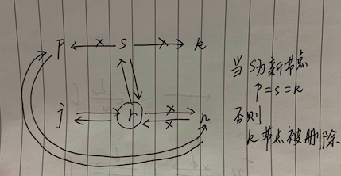

# 链表
讲数据结构就离不开讲链表,因为数据结构是用来组织数据的,如何将一个数据关联到另外一个数据呢?链表可以将数据和数据之间关联起来,从一个数据指向另外一个数据.

## 链表
定义:链表由一个数据节点组成的,它是一个递归结构,要么它存在一个指向另外一个数据节点的引用.

链表,可以说是最基础的数据结构.

最简单的链表程序:LinkNode

结构体`LinkNode`有两个字段,一个字段存放数据`Data`,另一个字典指向下一个节点`NextNode`.这种从一个数据节点指向下一个数据节点的结构,都可以叫做链表.

有些书籍,把链表做了很细的划分,比如单链表,双链表,循环链表,其实没有必要强行分类,链表就是从一个数据指向另外一个数据,一种将数据和数据关联起来的结构而已.

1. 单链表:就是链表单向的,像我们上面这个结构一样,可以一直往下找到下一个数据节点,它只有一个方向,它不能往回找.
2. 双链表:每个节点既可以找到它之前的节点,也可以找到之后的节点,是双向的.
3. 循环链表,就是它一直往下找数据节点,最后会后了自己那个节点,形成了一个回路,循环单链表和循环双链表的区别就是,一个只能一个方向走,一个两个方向都可以走.

我们来实现一个循环链表`Ring`
```
type Ring struct {
    next, prev *Ring
    Value interface{}
}
```

该循环链表有一个三个字段,`next`表示后驱节点,`prev`表示前驱节点,`Value`表示值.

添加节点的操作比较复杂,如果节点s是一个新的节点.

那么也就是再r节点后插入一个新节点s,而r节点之前的后驱节点,将会链接到新节点后面,并返回r节点之前的第一个后驱节点n,如图:



可以看到插入新节点,会重新形成一个环,新节点s被插入了中间

### 获取链表长度
```
// 查看循环链表长度
func (r *Ring) Len() int {
    n := 0
    if r != nil {
        n = 1
        for p := r.Next(); p != r; p = p.next {
            n++
        }
    }
    return n
}
```

通过循环,当引用回到自己,那么计数完毕,时间复杂度:O(n)
因为虚拟换链表还不够强大,不知道起始节点是哪个,计数链表长度还要遍历,所以用循环链表实现的双端队列就出现了,一般具有编程都使用更高层次的数据结构

## 数组和链表
数组是编程语言作为一种基本类型提供出来的,相同数据类型的元素按一定顺序排列的集合.

它的作用只有一种:存放数据,让你很快能找到存的数据.如果你不去额外改进它,它就只是存放数据而已,它不会讲一个数据系欸但和另外一个数据节点关联起来.比如建立一个大小为5的数组\
```
package main
import "fmt"
//  打印出：
//  [0 0 0 0 0]
//  [8 9 7 0 0]
//  7
func main() {
    array := [5]int64{}
    fmt.Println(array)
    array[0] = 8
    array[1] = 9
    array[2] = 7
    fmt.Println(array)
    fmt.Println(array[2])
}
```

我们可以通过下标0 1 2来获取数组中的数据,下标0 1 2就表示数据的位置,排第一位,排第二位,我们也可以把指定位置的数据替换成另外一个数据.

数组这一数据类型,是被编程语言高度抽象封装的结构,下标会转换成"虚拟内存地址"然后操作系统会自动帮我们进行寻址,这个寻址过程是特别快的,所以往数组的某个下标取一个值和放一个值,时间复杂度为O(1)

它是一种将"虚拟内存地址"和"数据元素"映射起来的内置语法结构,数据和数据之间是挨着,存放在一个连续的内存区域,每一个固定大小的内存片段都有一个虚拟的地址编号,当然这个虚拟内存不是真正的内存,每个程序启动都会有一个虚拟内存空间来映射真正的内存,这是计算机组成的内容,和数据结构也有点关系.

用数组也可以实现链表,比如定义一个数组`[5]Value`值类型为一个结构体`Value`
```
package main
import "fmt"
func ArrayLink() {
    type Value struct {
        Data      string
        NextIndex int64
    }
    var array [5]Value          // 五个节点的数组
    array[0] = Value{"I", 3}    // 下一个节点的下标为3
    array[1] = Value{"Army", 4} // 下一个节点的下标为4
    array[2] = Value{"You", 1}  // 下一个节点的下标为1
    array[3] = Value{"Love", 2} // 下一个节点的下标为2
    array[4] = Value{"!", -1}   // -1表示没有下一个节点
    node := array[0]
    for {
        fmt.Println(node.Data)
        if node.NextIndex == -1 {
            break
        }
        node = array[node.NextIndex]
    }
}
func main() {
    ArrayLink()
}
```

获取某一个下标的数据,通过该数据可以知道,下一个数据的下标是什么,然后拿出该下标的数据,继续往下做,问题是:有时候需要做删除,移动等各种操作,而数组的大小是固定的,需要大量空间移动,所以某些情况下,数组的效率很低.

数组和链表是两个不同的概念,一个是编程语言提供的基本数据类型,表示一个连续的内存空间,可通过一个索引访问数据,另一个是我们定义的数据结构,通过一个数据节点,可以定位到另一个数据节点,不要求连续的内存空间.

数组的有点是占用空间小,查询快,直接使用索引就可以获取数据元素,缺点是移动和删除数据元素需要大量移动空间.

链表的有点是移动和删除数据元素速度快,只要把相关的数据元素重新链接起来,但缺点是占用空间大,查找需要遍历.

很多其他的数据结构都由数组和链表配合实现的.

# 总结
链表和数组可以用来辅助构建各种基本数据结构.

数据结构名字特别多,在以后的计算机生涯中,有些自己造的数据结构,或者不常见的别人造的数据机构,不知道叫什么名字很正常,我们只需知道常见的数据结构即可.