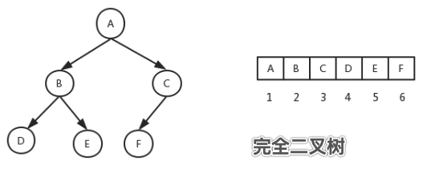

# 树
树是一种比较高级的基础数据结构,由n个有限节点组成的有层次关系的集合.

树的定义:

1. 有节点间的层次关系,分为父节点和子节点
2. 有唯一一个根节点,该根节点没有父节点
3. 除了根节点,每个节点有且只有一个父节点
4. 每一个节点本身以及它的后代也是一棵树,是一个递归的结构
5. 没有后代的节点称为叶子节点,没有节点的树称为空树

二叉树:每个节点最多只有两个儿子节点的树

满二叉树:叶子节点与叶子节点之间的高度差为`0`的二叉树,即整棵树是满的,树呈满三角形结构.国外的定义,非叶子的节点儿子都是满的树就是满二叉树.

完全二叉树:完全二叉树是由满二叉树而印出来的,设二叉树的深度为`k`,除第`k`层外,其他各层的节点数都达到最大值,且第`k`层所有的节点都连续集中在最左边.

树根据儿子节点的多寡,有二叉树,三叉树,四叉树

## 二叉树的数学特征
1. 高度为`h≥0`的二叉树至少有`h+1`个结点,比如最不平衡的二叉树就是退化的线性链表结构,所有的节点都只有左儿子节点,或者所有的节点都只有右儿子节点.
2. 高度为`h≥0`的二叉树至多有`2^h+1`个节点,比如这棵树是满二叉树.
3. 含有`n≥1`个结点的二叉树的高度至多有`n-1`,由`1`退化的线性链表可以反推
4. 含有`n≥1`个结点的二叉树的高度至少为`logn`,由`2`满二叉树可以反推
5. 在二叉树的第`i`层,至多有`2^(i-1)`个节点,比如该层是满的.

## 二叉树的实现
二叉树可以使用链表来实现.比如:
```
// 二叉树
type TreeNode struct {
    Data  string    // 节点用来存放数据
    Left  *TreeNode // 左子树
    Right *TreeNode // 右字树
}
```

当然,数组可以用来表示二叉树,一般用来表示完全二叉树.

对于一棵有`n`个节点啊的完全二叉树,从上到下,从左到右进行序号编号,对于任一个节点,编号`i=0`表示树根节点,编号`i`的节点的左右儿子节点编号分别为:`2i+1,2i+2`,父节点编号为:`i/2,整除操作去掉小数`

如图是一棵完全二叉树,数组的表示:


我们一般使用二叉树来实现查找的功能,所以树节点结构体里存放的数据`Data`字段

## 遍历二叉树
构建一个棵树后,我们希望遍历它,有4种遍历方法:

1. 先序遍历:先访问根节点,再访问左子树,最后访问右子树
2. 后序遍历:先访问左子树,再访问右子树,最后访问根节点
3. 中序遍历:先访问左子树,再访问根节点,最后访问右子树
4. 层次遍历:每一层从左到右访问每一个节点

先序,后序和中序遍历比较简单,如下:`rangeTreeNode`

层次遍历较复杂,用到一种名为广度遍历的方法,需要使用辅助的先进先出的队列.

1. 先将树的根节点放入队列
2. 从队列里面`remove`出节点,先打印节点值,如果该节点右左子树节点,左子树入栈,如果有右子树,右子树入栈.
3. 重复2,直到队列里面没有元素.

核心逻辑:
```
func LayerOrder(treeNode *TreeNode) {
    if treeNode == nil {
        return
    }
    // 新建队列
    queue := new(LinkQueue)
    // 根节点先入队
    queue.Add(treeNode)
    for queue.size > 0 {
        // 不断出队列
        element := queue.Remove()
        // 先打印节点值
        fmt.Print(element.Data, " ")
        // 左子树非空，入队列
        if element.Left != nil {
            queue.Add(element.Left)
        }
        // 右子树非空，入队列
        if element.Right != nil {
            queue.Add(element.Right)
        }
    }
}
```