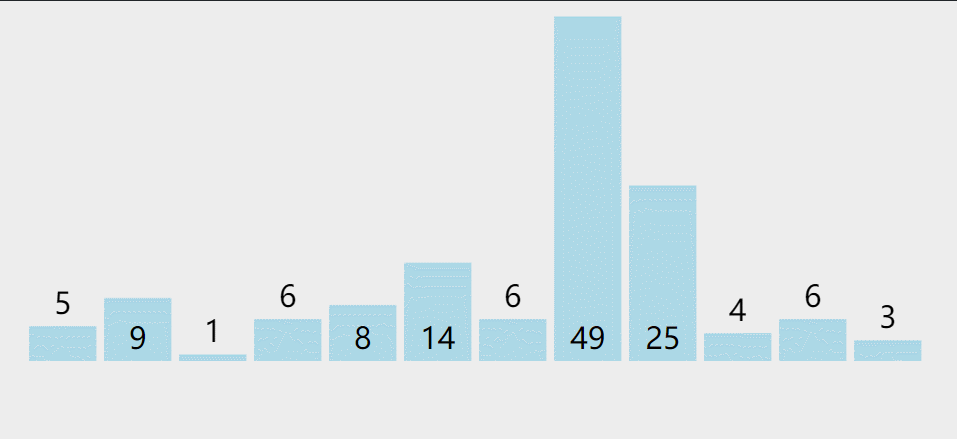
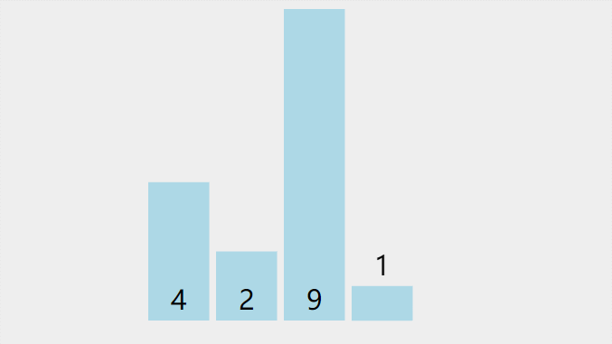

# 选择排序
选择排序,一般我们指的是简单选择排序,也可以叫直接选择排序,它不像冒泡排序一样相邻地交换元素,而是通过选择最小的元素,每轮迭代只需交换一次,虽然交换次数比冒泡少很多,但效率和冒泡排序一样的糟糕

选择排序属于选择类排序算法

我打扑克牌的时候,会习惯性地从左到右扫描,然后将最小的牌放在最左边,然后从第二张牌开始继续从左到右扫描第二小的牌,放在最小的牌右边,以此反复,选择排序和我玩扑克牌时的排序特别相似.

## 算法介绍
现在有一堆乱序的数,比如:`5 9 1 6 8 14 6 49 25 4 6 3`

第一轮迭代:从第一个数开始,左边到右边进行扫描,找到最小的数1,与数列里的第一个数交换位置

第二轮迭代:从第二个数开始,左边到右边进行扫描,找到第二小的数3,与数列里的第二个数交换位置.

第三轮迭代:从第三个数开始,左边到右边进行扫描,找到第三小的数4,与数列里的第三个数交换位置.

第四轮迭代:

第N轮迭代:....

经过交换,最后的结果位:`1 3 4 5 6 6 6 8 9 14 25 49`.我们可以看到已经排序好了


每次扫描数列找出的最小的数,然后与第一个数交换,然后排除第一个数,从第二个数开始重复这个操作,这种排序叫做简单选择排序.

举个简单的例子,选择排序一个4个元素的数列:`4 2 9 1`
```
[]表示排好序
起始： 4 2 9 1  未排序数列从左扫描最小的数是 1，与第一个元素 4 交换，交换 1，4
一轮： [1] 2 9 4 未排序数列从左扫描最小的数是 2，不需要交换
二轮： [1 2] 9 4 未排序数列从左扫描最小的数是 4，与第三个元素 9 交换，交换 4，9
三轮： [1 2 4] 9 未排序数列只有 1 个数，结束
结果： [1 2 4 9]
```


比较的次数和冒泡排序一样多,因为扫描过程也是比较的过程,只不过交换的次数减少为每轮1次,最佳和最坏时间复杂度仍然时:`O(n^2)`

选择排序是一个不稳定的排序算法,比如数组:`[5 6 5 1]`,第一轮迭代时最小的数是1,那么与第一个元素5交换位置,这样数组1就和数组5交换了位置,导致两个相同的数字5排序后位置变了

## 算法实现
程序`SelectSort`

## 算法改进
上面的算法需要从某个数开始,一直扫描到尾部,我们可以优化算法,使得复杂度减少一半.

我们每一轮,除来找最小数之外,还找最大数,然后分别和前面和后面的元素交换,这样循环次数减少一半

程序`SelectGoodSort`

优化后的选择排序还是很慢,它很好理解,但是还是不建议在工程上使用.