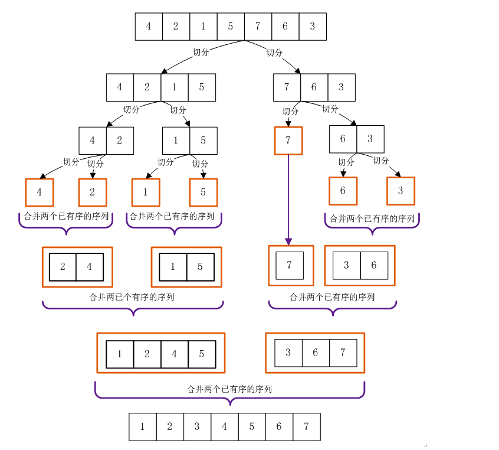
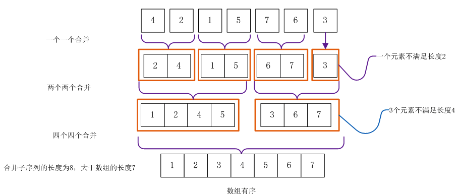
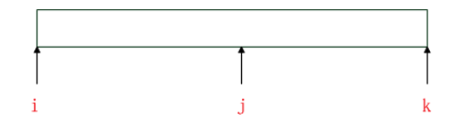
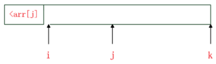
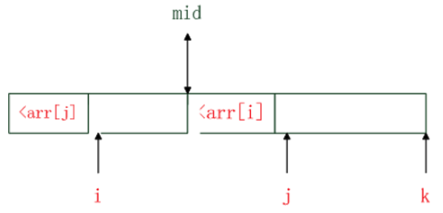

# 归并排序
归并排序是一种分治策略的排序算法,它是一种比较特殊的排序算法,通过递归地先使每个子序列有序,再将两个有序的序列进行合并成一个有序的序列.

归并排序首先由著名的现代计算机之父`John_von_Neumann`在1945年发明,被用在了`EDVAC`足足用墨水写了23页的排序程序.

# 算法介绍
我们先介绍两个有序的数组合并成一个有序数组的操作.

1. 先申请一个辅助数组,长度等于两个有序数组长度的和
2. 从两个有序数组的第一位开始,比较两个元素,哪个数组的元素更小,那么该元素添加进辅助数组,然后该数组的元素变更为下一位,继续重复这个操作,直至数组没有元素
3. 返回辅助数组

举一个例子:
```
有序数组A：[3 8 9 11 13]
有序数组B：[1 5 8 10 17 19 20 23]
[] 表示比较的范围。

因为 1 < 3，所以 1 加入辅助数组
有序数组A：[3 8 9 11 13]
有序数组B：1 [5 8 10 17 19 20 23] 
辅助数组：1

因为 3 < 5，所以 3 加入辅助数组
有序数组A：3 [8 9 11 13]
有序数组B：1 [5 8 10 17 19 20 23] 
辅助数组：1 3

因为 5 < 8，所以 5 加入辅助数组
有序数组A：3 [8 9 11 13]
有序数组B：1 5 [8 10 17 19 20 23] 
辅助数组：1 3 5

因为 8 == 8，所以 两个数都 加入辅助数组
有序数组A：3 8 [9 11 13]
有序数组B：1 5 8 [10 17 19 20 23] 
辅助数组：1 3 5 8 8

因为 9 < 10，所以 9 加入辅助数组
有序数组A：3 8 9 [11 13]
有序数组B：1 5 8 [10 17 19 20 23] 
辅助数组：1 3 5 8 8 9

因为 10 < 11，所以 10 加入辅助数组
有序数组A：3 8 9 [11 13]
有序数组B：1 5 8 10 [17 19 20 23] 
辅助数组：1 3 5 8 8 9 10

因为 11 < 17，所以 11 加入辅助数组
有序数组A：3 8 9 11 [13]
有序数组B：1 5 8 10 [17 19 20 23] 
辅助数组：1 3 5 8 8 9 10 11

因为 13 < 17，所以 13 加入辅助数组
有序数组A：3 8 9 11 13
有序数组B：1 5 8 10 [17 19 20 23] 
辅助数组：1 3 5 8 8 9 10 11 13

因为数组A已经没有比较元素，将数组B剩下的元素拼接在辅助数组后面。
结果：1 3 5 8 8 9 10 11 13 17 19 20 23
```

将两个有序数组进行合并,最多进行`n`次比较就可以生成一个新的有序数组,`n`是两个数组长度比较大的那个.

归并操作最坏的时间复杂度:`O(n)`,其中`n`是较长数组的长度

归并操作最好的时间复杂度:`O(n)`,其中`n`是较短数组的长度.

正是利用这个特点,归并排序先排序较小的数组,再将有序的小数组合并形成更大有序的数组.

归并排序有两种递归做法,一种是自顶向下,一种是自底向上.

### 自顶向下归并排序
从一个大数组开始,不断地往下切分,如图:


从上往下进行递归,直到切分的小数组无法切分了,然后不断地对这些有序数组进行合并.

每次都是一分为二,特别均匀,所以最差和最坏时间复杂度都一样,归并操作的时间复杂度:`O(n)`,因此总的时间复杂度为:`T(n)=2T(n/2)+O(n)`,根据主定理公式可以直到时间复杂度为:`O(nlogn)`.
```
归并排序，每次归并操作比较的次数为两个有序数组的长度： n/2
T(n) = 2*T(n/2) + n/2
T(n/2) = 2*T(n/4) + n/4
T(n/4) = 2*T(n/8) + n/8
T(n/8) = 2*T(n/16) + n/16
...
T(4) = 2*T(2) + 4
T(2) = 2*T(1) + 2
T(1) = 1
进行合并也就是：
T(n) = 2*T(n/2) + n/2
     = 2^2*T(n/4)+ n/2 + n/2
     = 2^3*T(n/8) + n/2 + n/2 + n/2
     = 2^4*T(n/16) + n/2 + n/2 + n/2 + n/2
     = ...
     = 2^logn*T(1) + logn * n/2
     = 2^logn + 1/2*nlogn
     = n + 1/2*nlogn
因为当问题规模 n 趋于无穷大时 nlogn 比 n 大，所以 T(n) = O(nlogn)。
因此时间复杂度为：O(nlogn)。
```

因为不断地递归,程序栈层数会有`logn`层,所以递归栈的空间复杂度:`O(logn)`,对于排序十几亿个整数,也只要:`log(100 0000 0000)=29.897`,占用的堆栈层数最多30层忧.

### 自底向上归并排序
从小数组开始排序,不断地合并形成更大的有序数组


时间复杂度和自顶向上归并排序一样也都是`O(nlogn)`

因为不需要使用递归,没有程序栈占用,因此递归栈的空间复杂度为:`O(1)`

## 算法实现
自顶向下的归并排序递归实现,程序`MergeSort`

自底向上的非递归实现,程序`MergeSort2`

## 算法改进
归并排序归并操作占用了额外的辅助数组,且归并操作是从一个元素的数组开始.

我们可以做两点改进:

1. 对于小规模数组,使用直接插入排序
2. 原地排序,节约掉辅助数组空间的占用

我们建议使用自底向上非递归排序,不会有程序栈空间损耗.

先来介绍一种翻转算法,也叫手摇算法,主要用来对数组两部分进行位置互换,比如数组:`[9,8,7,1,2,3]`将前3格元素与后面的3个元素交换位置,变成`[1,2,3,9,8,7]`

再比如,将字符串`abcde1234567`的前5个字符与后面的字符交换位置,那么手摇后变成:`1234567abcde`

如何翻转?

1. 将前部分逆序
2. 将后部分逆序
3. 对整体逆序

示例:
```
翻转 [1234567abcde] 的前5个字符。
1. 分成两部分：[abcde][1234567]
2. 分别逆序变成：[edcba][7654321]
3. 整体逆序：[1234567abcde]
```

归并原地排序利用了手摇算法的特征,不需要额外的辅助数组

首先,两个有序的数组,分别是`arr[begin,mid-1] arr[mid,end]`,此时初始化`i=begin,j=mid,k=end`从`i~j`为左有序的数组,`k~j`为右有序的数组,如图:


将`i`向后移动,找到第一个`arr[i]>arr[j]`的索引,这个时候`i`前面的部分已经排好序了,`begin~i`这些元素已经是两个有序数组的前`n`小个元素,如图:


然后将`j`向后移动,找到第一个`arr[j]>arr[i]`的索引,如图:


这个时候,`mid~j`中的元素都小于`arr[i]`,前面已经知道`begin~i`已经是前`n`小,所以这两部分`begin~i,mid~j`也是有序的了,我们想办法将这两部分连接在一起.

我们只需要进行翻转,将`i~mid`和`mid,j-1`部分进行位置互换即可,我们可以用手摇算法,具体代码`InsertSort`

我们自底开始,将元素按照数量为`blockSize`进行小数组排序,使用直接插入排序,然后我们对这些有序的数组向上进行归并操作

归并过程中,使用圆度归并,用了手摇算法`rotation`

因为手摇只多了逆序翻转的操作,时间复杂度是`O(n)`,虽然时间复杂度稍稍多了一点,但存储空间复杂度降了`O(1)`

归并排序是唯一一个有稳定性保证的高级排序算法,某些时候,为了寻求大规模数据下排序前后,相同元素位置不变,可以使用归并排序.