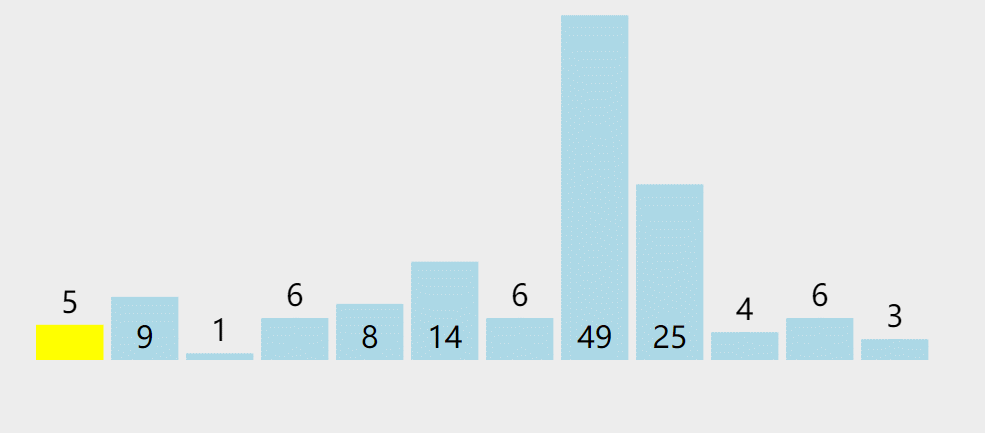

# 快速排序
快速排序时一种分治策略的排序算法.

本质上来看,快速排序是对冒泡排序的一种改进,属于交换类的排序算法

## 算法介绍
快速排序通过一趟排序将要排序的数据分割成独立的两部分,其中一部分的所有数据都比另外一部分的所有数据都要小,然后再按此方法对这两部分数据分别进行快速排序,整个排序过程可以递归进行,以此达到整个数据变成有序序列.

步骤如下:
1. 先从数列中取出一个数作为基准数,一般取第一个数
2. 分区过程,将比这个数大的数全部放到它的右边,小于或等于它的数全放到它的左边
3. 再对左右区分重复第二步,直到各区间只有一个数

举一个例子:`5 9 1 6 8 14 6 49 25 4 6 3`
```
一般取第一个数 5 作为基准，从它左边和最后一个数使用[]进行标志，
如果左边的数比基准数大，那么该数要往右边扔，也就是两个[]数交换，这样大于它的数就在右边了，然后右边[]数左移，否则左边[]数右移。
5 [9] 1 6 8 14 6 49 25 4 6 [3]  因为 9 > 5，两个[]交换位置后，右边[]左移
5 [3] 1 6 8 14 6 49 25 4 [6] 9  因为 3 !> 5，两个[]不需要交换，左边[]右移
5 3 [1] 6 8 14 6 49 25 4 [6] 9  因为 1 !> 5，两个[]不需要交换，左边[]右移
5 3 1 [6] 8 14 6 49 25 4 [6] 9  因为 6 > 5，两个[]交换位置后，右边[]左移
5 3 1 [6] 8 14 6 49 25 [4] 6 9  因为 6 > 5，两个[]交换位置后，右边[]左移
5 3 1 [4] 8 14 6 49 [25] 6 6 9  因为 4 !> 5，两个[]不需要交换，左边[]右移
5 3 1 4 [8] 14 6 49 [25] 6 6 9  因为 8 > 5，两个[]交换位置后，右边[]左移
5 3 1 4 [25] 14 6 [49] 8 6 6 9  因为 25 > 5，两个[]交换位置后，右边[]左移
5 3 1 4 [49] 14 [6] 25 8 6 6 9  因为 49 > 5，两个[]交换位置后，右边[]左移
5 3 1 4 [6] [14] 49 25 8 6 6 9  因为 6 > 5，两个[]交换位置后，右边[]左移
5 3 1 4 [14] 6 49 25 8 6 6 9  两个[]已经汇总，因为 14 > 5，所以 5 和[]之前的数 4 交换位置
第一轮切分结果：4 3 1 5 14 6 49 25 8 6 6 9  
现在第一轮快速排序已经将数列分成两个部分：
4 3 1 和 14 6 49 25 8 6 6 9
左边的数列都小于 5，右边的数列都大于 5。
使用递归分别对两个数列进行快速排序。
```



快速排序主要靠基准数据进行切分,将数列分成两部分,一部分比基准数都小,一部分比基准数都大.

### 时间复杂度
在最好的情况下,每一轮都能平均切分,每一轮遍历比较元素n次就可以把数列分成两部分,每一轮的时间复杂度都是`O(n)`.因为问题规模每次被折半,折半的数列继续递归进行切分,也就是总的时间复杂度计算公式尾:`T(n) = 2*T(n/2) + O(n)`.按照主定理公式计算,我们可以直到时间复杂度:`O(nlogn)`当然可以来具体计算:
```
我们来分析最好情况，每一轮切分，遍历比较元素的次数为 n
T(n) = 2*T(n/2) + n
T(n/2) = 2*T(n/4) + n/2
T(n/4) = 2*T(n/8) + n/4
T(n/8) = 2*T(n/16) + n/8
...
T(4) = 2*T(2) + 4
T(2) = 2*T(1) + 2
T(1) = 1
进行合并也就是：
T(n) = 2*T(n/2) + n
     = 2^2*T(n/4)+ n + n
     = 2^3*T(n/8) + n + n + n
     = 2^4*T(n/16) + n + n + n + n
     = ...
     = 2^logn*T(1) + logn * n
     = 2^logn + nlogn
     = n + nlogn
因为当问题规模 n 趋于无穷大时 nlogn 比 n 大，所以 T(n) = O(nlogn)。
最好时间复杂度为：O(nlogn)。
注：^ 表示乘方。
```

最差情况下,每次都不能平均地切分,每次切分都因为基准数是最大的或者最小的,不能分成两个数列,这样时间复杂度变为了`T(n) = T(n-1) + O(n)`,按照主定理计算可以知道时间复杂度:`O(n^2)`,我们可以来实际计算:
```
我们来分析最差情况，每一轮切分，遍历比较元素的次数为 n
T(n) = T(n-1) + n
     = T(n-2) + n-1 + n
     = T(n-3) + n-2 + n-1 + n
     = ...
     = T(1) + 2 +3 + ... + n-2 + n-1 + n
     = O(n^2)
最差时间复杂度为：O(n^2)。
注：^ 表示乘方。
```

根据熵的概念,数量越大,随机性越高,越自发无序,所以待排序数据规模非常大时,出现最差情况的情形较少.在综合情况下,快递排序的平均时间复杂度为`O(nlogn)`,对比之前介绍的排序算法,快递排序比那么动不动就是平方级别的初级排序算法更佳.

#### 空间复杂度
快速排序使用原地排序,存储空间复杂度:`O(1)`.而因为递归栈的影响,递归的程序栈开辟的层数范围在`logn~n`,所以递归栈的空间复杂度:`O(logn) ~ log(n)`最坏为:`log(n)`,当元素较多时,程序栈可能溢出,通过改进算法,使用伪尾递归进行优化,递归栈的空间复杂度可以减小到`O(logn)`

### 切分优化
切分的结果极大地影响快速排序的性能,比如每次切分的时候选择的基准数都是数组中最大或最小的,会出现最坏的情况,为了避免切分不均匀情况的发生,有几种方法改进:
1. 随机基准数选择:每次进行快速排序切分时,先将数列随机打乱,再进行切分,这样随机加了个震荡,减少不均匀的情况.当然,也可以随机选择一个基准数,而不是选择第一个数
2. 中位数选择:每次取数列头部,中部,尾部三个数,取三个数的中位数为基准数进行切分

方法1相对好,而方法2引入了额外的比较操作,一般情况下可以随机选择一个基准数.

从一个数组中随机选择一个数,或者取中位数都比较容易实现,我们在此就不实现了,避免造成心智负担.

## 算法实现
这是最普通的一种实现,程序`QuickSort`

示例图:


快速排序,每一次切分都维护两个下标,进行推进,最后将数列分成两部分

## 算法改进
快死排序可以继续进行算法改进

1. 在小规模数组的情况下,直接插入排序的效率最好,当快速排序递归部分进入小数组范围,可以切换成直接插入排序
2. 排序数组可能存在大量重复值,使用三向切分快速排序,将数组分成三部分,大于基准数,等于基准数,小于基准数,这个时候需要维护三个下标
3. 使用伪尾递归减少程序栈空间占用,使得栈空间复杂度从`O(logn)~log(n)`变成:`O(logn)`

### 改进:小规模数组使用直接插入排序
在小规模数组的情况下,直接插入排序的效率最好,当快速排序递归进入小数组范围,可以切换成直接插入排序,程序`InsertSort`

直接插入排序在小规模数组下效率极好,我们只需将`end-begin <= 4`的递归部分换成直接插入排序,这部分表示小数组排序

### 改进:三向切分
排序数列可能存在大量重复值,使用三向切分快速排序,将数组分成三部分,大于基准数,等于基准数,小于基准数,这个时候需要维护三个下标,程序`QuickSort2`

演示:
```
数列：4 8 2 4 4 4 7 9，基准数为 4
[4] [8] 2 4 4 4 7 [9]  从中间[]开始：8 > 4，中右[]进行交换，右边[]左移
[4] [9] 2 4 4 4 [7] 8  从中间[]开始：9 > 4，中右[]进行交换，右边[]左移
[4] [7] 2 4 4 [4] 9 8  从中间[]开始：7 > 4，中右[]进行交换，右边[]左移
[4] [4] 2 4 [4] 7 9 8  从中间[]开始：4 == 4，不需要交换，中间[]右移
[4] 4 [2] 4 [4] 7 9 8  从中间[]开始：2 < 4，中左[]需要交换，中间和左边[]右移
2 [4] 4 [4] [4] 7 9 8  从中间[]开始：4 == 4，不需要交换，中间[]右移
2 [4] 4 4 [[4]] 7 9 8  从中间[]开始：4 == 4，不需要交换，中间[]右移，因为已经重叠了
第一轮结果：2 4 4 4 4 7 9 8
分成三个数列：
2
4 4 4 4 (元素相同的会聚集在中间数列)
7 9 8
接着对第一个和最后一个数列进行递归即可。
```

示例图:


三切分,把小于基准数的扔到左边,大于基准数的扔到右边,相同的元素会进行聚集

如果存在大量重复元素,排序速度将极大提高,将会是线性时间,因为相同的元素将会聚集在中间,这些元素不再进入下一个递归迭代.


### 改进:伪尾递归优化
使用伪尾递归减少程序栈空间占用,使得栈空间复杂度从`O(logn) ~ log(n)`变为`O(logn)`
```
// 伪尾递归快速排序
func QuickSort3(array []int, begin, end int) {
    for begin < end {
        // 进行切分
        loc := partition(array, begin, end)
        // 那边元素少先排哪边
        if loc-begin < end-loc {
            // 先排左边
            QuickSort3(array, begin, loc-1)
            begin = loc + 1
        } else {
            // 先排右边
            QuickSort3(array, loc+1, end)
            end = loc - 1
        }
    }
}
```

很多人以为这样子是尾递归,其实这样的快排写法是伪装的尾递归,不是真正的尾递归,因为有`for`循环,不是直接`return QuickSort`,递归还是不断地压栈,栈的层次仍然不断地增长.

但是,因为先让规模小的部分排序,栈的深度大大减少,程序栈最深不会超过`logn`层,这样堆栈最坏空间复杂度`O(n)`降为`O(logn)`

这种优化也是一种很好的优化,因为栈的层数减少了,对于排序十亿个整数,也只要`log(100 0000 0000)=29.897`,占用的堆栈层数最多30层,比不进行优化,可能出现的`O(n)`常数层好很多.

### 补充:非递归写法
程序`LinkStack`

## 补充:内置库使用快速排序的原因
首先对排序,归并排序最好最坏时间复杂度都是`O(nlogn)`,而快速排序最坏的时间复杂度`O(n^2)`,但是很多编程语言内置的排序算法使用的仍然时快速排序,so?
1. 问题有偏颇,选择排序算法要看具体的场景,linux内核用的排序算法就是堆排序,而java对于数量比较多的复杂对象排序,内置排序使用的是归并排序,只是一般情况下,快速排序更快
2. 归并排序有两个稳定,第一个稳定是排序前面后相同的元素位置不变,第二个稳定是,每次都是平均地进行排序,读取数据也是顺序读取,能够利用存储器缓存的特征,比如从磁盘读取数据进行排序,因为排序过程需要占用额外的辅助数组空间,所以这部分有代价损耗,但是原地手摇的归并排序克服了这个缺陷
3. 复杂度中,大`O`有一个常数项被省略了,堆排序每次取最大的值之后,都需要进行节点翻转,重新恢复堆的特征,做了大量误用功,常数项比快速排序大,大部分情况下比快速排序慢很多,但是堆排序时间较稳定,不会出现快排最坏的情况,且省空间,不需要额外的存储空间和栈空间
4. 当待排序数量大于16000个元素时,使用自底向上的堆排序比快速排序快
5. 快速排序最坏情况下复杂度高,主要在于切分不像归并排序一样平均,而是很依赖基准数的现在,我们通过改进,比如随机数,三切分等,这种最坏情况的概率极大的复杂度高,大多数情况下,它并不会那么地坏,大多数快才是真的快
6. 归并排序和快速排序都是分治法,排序的数据都是相邻的,而堆排序比较的数可能跨越很大的范文,导致局部性命中率降低,不能利用现代存储器缓存的特征,加载数据过程会损失性能.

对稳定性有要求的,要求排序前后相同元素位置不变,可以使用归并排序,java中的复杂对象类型,要求排序前后位置不能发生变化,所以小规模数据下舒勇了直接插入排序,大规模数据下使用了归并排序

对栈,存储空间有要求的可以使用堆排序,比如linux内核栈小,快速排序占用程序栈太大,使用快速排序可能栈溢出,所以使用堆排序

## 补充:Golang内置排序库sort
Golang中标准库sort中使用了多种排序算法,值得研究