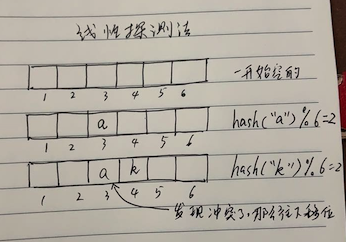
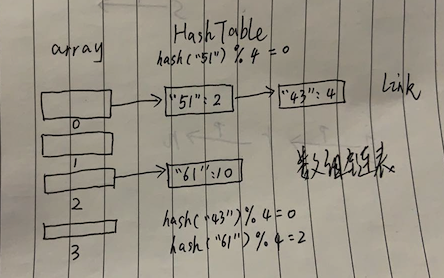
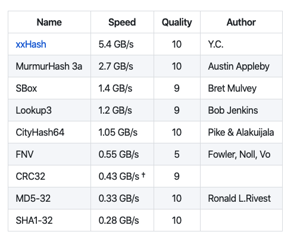

# 线性查找
我们要通过一个`键key`来查找响应的`值value`.有一种最简单的方式,就是将键值对存放在链表里,然后遍历表来查找是否存在`key`,存在则更新键对应的值,不存在则将键值对链接到链表上.

这种链表查找,最坏的时间复杂度:`O(n)`,因为可能遍历到的链表最后也没找到.

# 散列查找
有一种算法叫散列查找,也称哈希查找,是一种空间换时间的查找算法,依赖的数据结构称为哈希表或散列表:`HashTable`

Hash:翻译为散列,哈希,主要指压缩映射,它将一个比较大的域空间映射到一个比较小的域空间,简单的说就是把任意长度的消息压缩到某一固定长度的消息摘要的函数,Hash算法虽然是一种算法,但更像一种思想,没有一个固定的公式,只要符合这种思想的算法都称Hash算法.

散列查找,主要是将键进行`hash`计算得出一个大整数,然后与数组长度进行取余,这样一个比较大的域空间就只会映射到数组的下标范围,利用数组索引快的特征,用空间换时间的思路,使得查找的速度快于线性查找.

首先有一个大数组,每当存一个键值对时,先把键进行哈希,计算出的哈希值是一个整数,使用这个整数对数组长度取余,映射到数组的某个下标,把该键值对存起来,取数据时按同样的步骤进行查找.

有2种方式实现哈希表:先行探索和拉链法

# 哈希表:线性探测法
先行探索实现的哈希表时一个大数组.

首先,哈希表数据结构会初始化`N`个大小的数组,然后存取键`key`时,会求键的哈希值`hash(key)`,这是一个整数,然后与数组的大小进行取余,`hash(key)%N`将会知道该键值对要存在数据的哪个位置.

如果数组该位置已经被之前的键值对占领了,也就是哈希冲突,那么会偏移加1,探测下个位置是否被占用,如果下个位置为空,那么占位,否则继续探测,查找时,也是查看该位置是否为该键,不是则继续往该位置的下一个位置查找,因为这个步骤是线性的,所以叫线性探测法.


# 哈希表:拉链法
拉链法实现的哈希表是一个数组链表,也就是数组中的元素是链表,数组链表很想一条条拉链,所以又叫拉链查找.

首先,哈希表数据结构会初始化,`N`个小的数组,然后取键`key`时,会求键的哈希值`hash(key)`这是一个整数,然后与数组的大小取余:`hash(key)%N`,将会知道该键值对要存在数组的哪个位置

如果数组该位置已经被之前的键值对占领了,也就是哈希冲突,那么键值会追加之前键值对的后面,形成一条链表.

比如`51`的哈希`hash(51)`假设为4,那么`hash(51)%4=4%4=0`,所以放在数组的第一个位置,同样键43的哈希`hash(43)`假设8,那么`hash(43)%4=8%4=0`同样要放在数组的第一个位置.

因为哈希冲突了,所以键43链接在键51后面.


查找的时候,也会继续这个过程,比如查找键43,进行哈希后得到位置0,定位到数组第一位,然后遍历这条链表,先找到键51,发现不对,往下找,直到找到键43

golang内置的数据类型:字典`map`就是用拉链法的哈希表实现的,但相对复杂.

# 哈希函数
当哈希冲突不严重的时候,查找某个键,只需要求哈希值,然后取余,定位到数组的某个下标即可,时间复杂度`O(1)`

当哈希冲突十分严重的时候,每个数组元素对应的链表会越来越长,即使定位到数组的某个下标,也要遍历一条很长很长的链表,就退化为查找链表了,时间复杂度:`O(n)`

所以哈希表首先要解决的问题时寻找相对均匀,具有很好随机分不行的哈希函数`hash()`,这样才不会扎堆冲突

golang语言实现的哈希函数参考了以下两种哈希算法
1. xxhash: https://code.google.com/p/xxhash
2. cityhash: https://code.google.com/p/cityhash

当然还有其他哈希算法如`MurmurHash`https://code.google.com/p/smhasher

还有哈希算法如`md4`和`md5`

我们使用号称计算速度最快的哈希`xxhash`,直接用该库来实现哈希:https://github.com/OneOfOne/xxhash


程序`XXHash`

拿到哈希值之后,我们要对结果取余,方便定位数组下标`index`.如果数组的长度为`len`,那么`index=xxhash(key)%len`.

比如数组长度`len=8`,那么取余之后可能有这些结果:
> xxhash(key) % 8 = 0，1，2，3，4，5，6，7

如果我们选择`2^x`作为数组长度有一个很好的优点,就是计算速度变快了如下是一个恒等式:
> 恒等式 hash % 2^k = hash & (2^k-1)，表示截断二进制的位数，保留后面的 k 位

这样取余`%`操作将变成按位`&`操作:
```
哈希表数组长度 len=8，
存在一个哈希值 hash=165，二进制表示为 1010 0101
所以： 
165 % 8 
= 165 % 2^3
= 165 & (2^3-1)
= 165 & 7
= 1010 0101 & 0000 0111 
= 0000 0000 0101 
= 5
```

选择`2^`长度会使得计算速度更快,但是相当于截断二进制后保留后面的`k`位,如果存在很多哈希值的值很大,位数超过了`k`位,而二进制后`k`位都相同,那么会导致大片哈希冲突.

即使如此,存在很大哈希值的情况很少发生,大部分哈希值的二进制位数都不会超过`k`位,因此编程语言golang使用了这种`2^`长度作为哈希表的数组长度

实际上`hash(key)%len`的分布和`len`有关的,一组均匀分布的`hash(key)`在len是素数时才能做到均匀.

> 素数:也叫质数，是指在大于 1 的自然数中，除了 1 和它本身以外不再有其他因数的自然数，也就是与任何数的最大公约数都为1。

举例如下:
```
f(n)为哈希表的下标，哈希表的长度是 m，而哈希值是 n，记 w=gcd(m,n) 为两个数的最大公约数，
那么：
f(n) = n % m 
     = n - a*m (a=0,1,2,3,4...)
     = w * (n/w-a*m/w)
因为 w=gcd(m,n)，所以 (n/w-a*m/w) 是一个整数。
所以哈希表的下标 f(n) 只会是 w=gcd(m,n) 的倍数，倍数就注定了不会均匀分布在 `[0,m-1]`，除非 w=1。
在哈希值数列数量特别多的情况，对偶数和奇数数列进行取余求下标，如长度 m=5 和 m=6：
哈希数值：2 4 6 8 10 12 14 16 18 20 22...
m=5时下标：2 4 1 3 0 2 4 1 3 0 2...
m=6时下标：2 4 0 2 4 0 2 4 0 2 4...
哈希数值：1 3 5 7 9 11 13 15 17...
m=5时下标：1 3 0 2 4 1 3 0 2...
m=6时下标：1 3 5 1 3 5 1 3 5...
偶数队列可以看到素数5一直重复 `2 4 1 3 0`，而合数6一直重复 `2 4 0`，只有素数均匀分布。
奇数队列可以看到素数5一直重复 `1 3 0 2 4`，而合数6一直重复 `1 3 5`，只有素数均匀分布。
将偶数和奇数数列合并起来，步长为1时，素数和奇数都一样均匀，仅当步长不为1时的随机数列，素数会更均匀点。
```

# 实现拉链哈希表
实现拉链哈希表有以下的一些操作:

1. 初始化:新建一个`2^`个长度的数组,一开始`x`较小
2. 添加键值:进行`hash(key)&(2^x-1)`,定位到数组下标,查找数组下标对应的链表,如果链表有该键,更新其值,否则追加元素
3. 获取键值:进行`hash(key)&(2^x-1)`,定位到数组下标,查找数组下标对应的链表,如果链表不存在该键,返回false,否则返回该值以及true
4. 删除键值:进行`hash(key)&(2^x-1)`,定位到数组下标,查找数组下标对应的链表,如果链表不存在该键,直接返回,否则删除该键.
5. 进行键值增删时如果数组容量太大或者太小,需要响应缩容或扩容.

哈希查找的速度快,主要是利用空间换时间的优点,如果哈希表的数组特别大特别大,那么哈希冲突的几率就会降低,然而哈希表中的数组太大或太小都不行,太大浪费空间,太小则哈希冲突太严重,所以需要对哈希表中的数组进行缩容和扩容.

如何伸缩主要根据哈希表的大小和已添加的元素数量来决定,假设哈希表的大小位`16`,已添加到哈希表中的键值对数量是8,我们称`8/16=0.5`为加载因子`factor`

我们可以设定加载因子`factor<=0.125`时进行数组缩容,每次将容量砍半,当加载因子`factor>=0.75`进行数组扩容,每次将容量翻倍.

我们使用结构体`HashMap`来表示哈希表,见程序:

## 初始化哈希表

## 计算哈希表和数组下标

## 添加键值对

## 获取键值对

## 删除键值对

## 遍历打印哈希表

## 示例运行

> 程序'HashMap.go'

# 总结
哈希表查找,是一种用空间换时间查找算法,时间复杂度能达到`O(1)`,最坏情况下退化到查找链表`O(n)`,但均匀性很好的哈希算法以及合适空间大小的数组,在很大概率避免了最坏情况.

哈希表在添加元素时会进行伸缩,会造成较大的性能消耗,所以有时候会用到其他的查找算法:树查宅算法