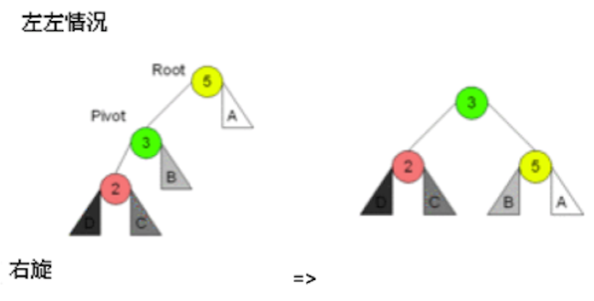
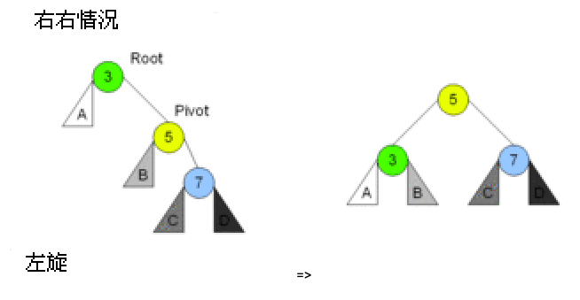
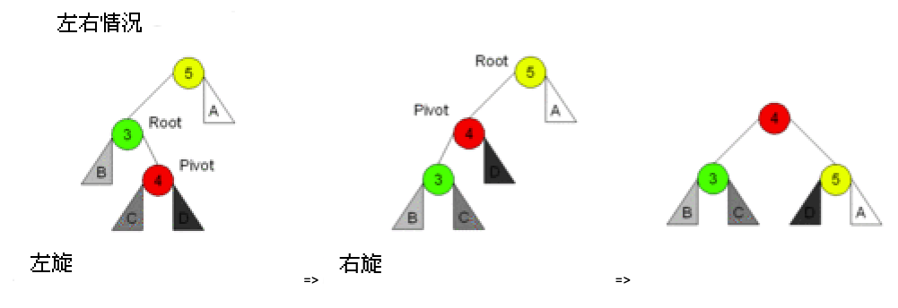
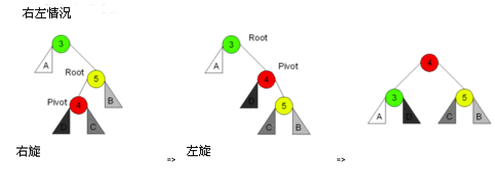

# AVl树
## AVL树介绍
AVL树是一棵严格平衡的二叉查找树,1962年发明者Adelson-Velsky 和 Landis 发表了论文，以两个作责的名字命名了该数据结构.

定义如下:

1. 首先它是一棵二叉查找树
2. 任意一个节点的左右子树最大高度差为1

由于树特征定义,我们可以计算出其高度h的上界`h<=1.44log(n)`也就是最坏情况,树的高度约等于`1.44log(n)`

> 假设高度 h 的AVL树最少有 f(h) 个节点，因为左右子树的高度差不能大于1，所以左子树和右子树最少节点为： f(h-1)，f(h-2)。
> 因此，树根节点加上左右子树的节点，满足公式 f(h) = 1 + f(h-1) + f(h-2)，初始条件 f(0)=0,f(1)=1。
> 经过数学的推算可以得出 h<=1.44log(n)，由于计算过程超纲了，在此不进行演算。

树的高度被限制于`1.44log(n)`,所以查找元素时使用二分查找,最坏查找`1.44log(n)`次,此时最坏时间复杂度为`1.44log(n)`,去掉常数项,时间复杂度:`log(n)`

为了维持AVL树的特征,每次添加和删除元素都需要一次或多次旋转来调整树的平衡,调整的依据来自二叉树节点的平衡因子:节点的左子树与右子树的高度差称为该节点的平衡因子,约束范围:`[-1,0,1]`

平衡二叉查找树比较难以理解的是添加和删除元素的调整操作.

## AVL树基本结构
```go
// AVL树
type AVLTree struct {
    Root *AVLTreeNode // 树根节点
}
// AVL节点
type AVLTreeNode struct {
    Value  int64                 // 值
    Times  int64                 // 值出现的次数
    Height int64                 // 该节点作为树根节点，树的高度，方便计算平衡因子
    Left   *AVLTreeNode // 左子树
    Right  *AVLTreeNode // 右字树
}
// 初始化一个AVL树
func NewAVLTree() *AVLTree {
    return new(AVLTree)
}
```

其中,Height表示以该节点作为树的根节点时该树的高度,方便计算平衡因子.更新树的高度,代码如下:
```go
// 更新节点的树高度
func (node *AVLTreeNode) UpdateHeight() {
    if node == nil {
        return
    }
    var leftHeight, rightHeight int64 = 0, 0
    if node.Left != nil {
        leftHeight = node.Left.Height
    }
    if node.Right != nil {
        rightHeight = node.Right.Height
    }
    // 哪个子树高算哪棵的
    maxHeight := leftHeight
    if rightHeight > maxHeight {
        maxHeight = rightHeight
    }
    // 高度加上自己那一层
    node.Height = maxHeight + 1
}
```

计算树的平衡因子,也就是左右子树的高度差,代码如下:
```go
// 计算平衡因子
func (node *AVLTreeNode) BalanceFactor() int64 {
    var leftHeight, rightHeight int64 = 0, 0
    if node.Left != nil {
        leftHeight = node.Left.Height
    }
    if node.Right != nil {
        rightHeight = node.Right.Height
    }
    return leftHeight - rightHeight
}
```

## AVL树添加元素
添加元素前需要定位到元素的位置,也就是使用二分查找找到该元素需要插入的地方.

插入后,需要满足所有节点的平衡因子在`[-1,0,1]`范围内,如果不在,需要进行旋转调整.

旋转有四种情况:

1. 在右子树上插上右儿子导致失衡,左旋,转一次.
2. 在左子树上插上左儿子导致失衡,右旋,转一次.
3. 在左子树上插上右儿子导致失衡,先左后右旋,转两次.
4. 在右子树上插上左儿子导致失衡,先右后左旋,转两次.

旋转规律记忆法:单旋和双旋,单旋反方向,双旋同方向.以下示意图:


### 左子树插左儿子:单右旋
在左子树上插上左儿子导致失衡,需要单右旋:


因为红色元素`2`的产生,其最近的父亲节点`Root`失衡了,元素`2`导致了元素`Root=5`的失衡,需要调整.

将`Pivot=3`代替元素`5`的位置成为新的`Root`然后元素`5`委屈一下成为`3`的右儿子,而`3`的右儿子变成了`5`的左儿子.

响应调整后的高度降低了,该失衡消失.红色元素`2`有两个儿子,实际上在添加操作时它是一个新的节点,是没有儿子的,这种有儿子的情况只发生在删除操作.代码如下:
```go
// 单右旋操作，看图说话
func RightRotation(Root *AVLTreeNode) *AVLTreeNode {
    // 只有Pivot和B，Root位置变了
    Pivot := Root.Left
    B := Pivot.Right
    Pivot.Right = Root
    Root.Left = B
    // 只有Root和Pivot变化了高度
    Root.UpdateHeight()
    Pivot.UpdateHeight()
    return Pivot
}
```

### 右子树插右儿子:单左旋
在右子树上插右儿子导致失衡,需要单左旋:


代码如下:
```go
// 单左旋操作，看图说话
func LeftRotation(Root *AVLTreeNode) *AVLTreeNode {
    // 只有Pivot和B，Root位置变了
    Pivot := Root.Right
    B := Pivot.Left
    Pivot.Left = Root
    Root.Right = B
    // 只有Root和Pivot变化了高度
    Root.UpdateHeight()
    Pivot.UpdateHeight()
    return Pivot
}
```

### 左子树插右儿子:先左后右旋
在左子树上插上右儿子导致失衡:先左后右旋:


代码如下:
```go
// 先左后右旋操作，看图说话
func LeftRightRotation(node *AVLTreeNode) *AVLTreeNode {
    node.Left = LeftRotation(node.Left)
    return RightRotation(node)
}
```

直接复用了之前左旋和右旋的代码,虽然难以理解,但是画一下图,确实这样调整后树高度降了,不再失衡.

### 右子树插左儿子:先右后左旋
在右子树上插上左儿子导致失衡,先右后左旋:


代码如下:
```go
// 先右后左旋操作，看图说话
func RightLeftRotation(node *AVLTreeNode) *AVLTreeNode {
    node.Right = RightRotation(node.Right)
    return LeftRotation(node)
}
```

### 具体实现
四种旋转代码实现后,我们开始进行添加元素操作:
```go
// 添加元素
func (tree *AVLTree) Add(value int64) {
    // 往树根添加元素，会返回新的树根
    tree.Root = tree.Root.Add(value)
}
func (node *AVLTreeNode) Add(value int64) *AVLTreeNode {
    // 添加值到根节点node，如果node为空，那么让值成为新的根节点，树的高度为1
    if node == nil {
        return &AVLTreeNode{Value: value, Height: 1}
    }
    // 如果值重复，什么都不用做，直接更新次数
    if node.Value == value {
        node.Times = node.Times + 1
        return node
    }
    // 辅助变量
    var newTreeNode *AVLTreeNode
    if value > node.Value {
        // 插入的值大于节点值，要从右子树继续插入
        node.Right = node.Right.Add(value)
        // 平衡因子，插入右子树后，要确保树根左子树的高度不能比右子树低一层。
        factor := node.BalanceFactor()
        // 右子树的高度变高了，导致左子树-右子树的高度从-1变成了-2。
        if factor == -2 {
            if value > node.Right.Value {
                // 表示在右子树上插上右儿子导致失衡，需要单左旋：
                newTreeNode = LeftRotation(node)
            } else {
                //表示在右子树上插上左儿子导致失衡，先右后左旋：
                newTreeNode = RightLeftRotation(node)
            }
        }
    } else {
        // 插入的值小于节点值，要从左子树继续插入
        node.Left = node.Left.Add(value)
        // 平衡因子，插入左子树后，要确保树根左子树的高度不能比右子树高一层。
        factor := node.BalanceFactor()
        // 左子树的高度变高了，导致左子树-右子树的高度从1变成了2。
        if factor == 2 {
            if value < node.Left.Value {
                // 表示在左子树上插上左儿子导致失衡，需要单右旋：
                newTreeNode = RightRotation(node)
            } else {
                //表示在左子树上插上右儿子导致失衡，先左后右旋：
                newTreeNode = LeftRightRotation(node)
            }
        }
    }
    if newTreeNode == nil {
        // 表示什么旋转都没有，根节点没变，直接刷新树高度
        node.UpdateHeight()
        return node
    } else {
        // 旋转了，树根节点变了，需要刷新新的树根高度
        newTreeNode.UpdateHeight()
        return newTreeNode
    }
}
```

一开始从树根节点开始插入新值:`tree.Root = tree.Root.Add(value)`,因为插入值后会返回新的根节点,也就是说调整过程中树根节点会变化,所以要重新将新根节点赋予老的根节点.

在`func (node *AVLTreeNode) Add(value int64)`函数中,如果根节点为空,那么需要返回新的根节点:
```go
    // 添加值到根节点node，如果node为空，那么让值成为新的根节点，树的高度为1
    if node == nil {
        return &AVLTreeNode{Value: value, Height: 1}
    }
```

接着,如果插入的值和节点的值一样,直接更新`Times`:
```go
// 如果值重复，什么都不用做，直接更新次数
    if node.Value == value {
        node.Times = node.Times + 1
        return node
    }
```

否则根据值的大小,旋转插入到左子树或右子树,分析插入右子树的代码:
```go
if value > node.Value {
    // 插入的值大于节点值，要从右子树继续插入
    node.Right = node.Right.Add(value)
    // 平衡因子，插入右子树后，要确保树根左子树的高度不能比右子树低一层。
    factor := node.BalanceFactor()
    // 右子树的高度变高了，导致左子树-右子树的高度从-1变成了-2。
    if factor == -2 {
        if value > node.Right.Value {
            // 表示在右子树上插上右儿子导致失衡，需要单左旋：
            newTreeNode = LeftRotation(node)
        } else {
            //表示在右子树上插上左儿子导致失衡，先右后左旋：
            newTreeNode = RightLeftRotation(node)
        }
    }
}
```

因为值添加到了右子树,所以转换成了在右子树添加元素:`node.Right=node.Right.Add(value)`,之后要判断根节点的平衡因子是否变化了.

值插入右子树后,要确保树根左子树的高度不能比右子树低一层,当平衡因子`factor==-2`表示右子树的高度变高了,导致`左子树-右子树`的高度从-1变成了-2,所以要旋转.

判断新插入的值是右子树的左儿子还是右儿子上:
```go
if value > node.Right.Value {
    // 表示在右子树上插上右儿子导致失衡，需要单左旋：
    newTreeNode = LeftRotation(node)
} else {
    //表示在右子树上插上左儿子导致失衡，先右后左旋：
    newTreeNode = RightLeftRotation(node)
}
```

如果在右子树上插上右儿子导致失衡,需要单左旋:`LeftRotation(node)`,如果在右子树上插上左儿子导致失衡,先右后左旋:`RightLeftRotation(node)`

最后需要更新树根节点的高度,并返回树根(如果曾经旋转,表示树根变了,需要返回新的树根):
```go
if newTreeNode == nil {
    // 表示什么旋转都没有，根节点没变，直接刷新树高度
    node.UpdateHeight()
    return node
} else {
    // 旋转了，树根节点变了，需要刷新新的树根高度
    newTreeNode.UpdateHeight()
    return newTreeNode
}
```

### 时间复杂度分析
添加元素时先要找到元素插入的位置,找到位置后逐层自底向上更新每个子树的树高度,并且根据子树平衡是否被破坏,需要进行旋转操作.

由于树的高度最高为`1.44log(n)`,查找元素插入位置,最坏次数为`1.44log(n)`次,逐层更新子树高度并判断平衡是否被破坏,最坏需要`1.44log(n)`次,因此可以得知添加元素最坏时间复杂度为:`2.88log(n)`去掉常数项,时间复杂度:`log(n)`

关于旋转次数,当插入节点后,某子树不平衡时最多旋转2次,也就是双旋该子树即可恢复平衡,该调整为局部特征,调整完后其父层不再需要旋转,也就是说,插入操作最坏旋转2次即可.

由于代码的递归实现方式,当某子树旋转过后其父层子树仍然需要判断平衡因子,判断是否需要旋转,该操作是不必要的1,因为子树旋转过后全局已经平衡了不必再判断父层的平衡因子.

对此可以进行代码优化,在左子树或右子树插入元素后,除了返回根节点,还返回其是否旋转过的辅助变量,如:`func (node *AVLTreeNode) Add(value int64) (newNode *AVLTreeNode, rotate bool)` ，根据返回的辅助变量 rotate，可以：
```go
    node.Right, rotate= node.Right.Add(value)
    if !rotate {
        //  子树没有旋转过，那么需要判断是否需要旋转
        // 平衡因子，插入右子树后，要确保树根左子树的高度不能比右子树低一层。
        factor := node.BalanceFactor()
        // 右子树的高度变高了，导致左子树-右子树的高度从-1变成了-2。
        if factor == -2 {
            if value > node.Right.Value {
                // 表示在右子树上插上右儿子导致失衡，需要单左旋：
                newTreeNode = LeftRotation(node)
            } else {
                //表示在右子树上插上左儿子导致失衡，先右后左旋：
                newTreeNode = RightLeftRotation(node)
            }
        }
    }else{
        // do nothing
    }
```

但此优化意义不大,因为返回辅助变量后仍然需要判断,判断辅助变量和判断平衡因子,时间复杂度一样.

插入元素进行调整后,需要递归向上更新每一棵子树高度,其时间复杂度为`log(n)`,但可以优化,当两棵子树高度都没有变化时,那么上面的父层子树都不需要更新树高度,直接退出,由于是递归程序,如何向上传递信息,引入了额外空间成本,且不可避免仍然会出现所有层级的父节点都必须更新树高度,优化意义不是很大

## AVL树查找元素等操作