# `2-3-4`树和普通红黑树
红黑树是一种近似平衡的二叉查找树,从`2-3`树或`2-3-4`树衍生而来,通过对二叉树节点进行染色,染色为红或黑节点,来模仿`2-3`树或`2-3-4`树的3节点和4节点,从而让树的高度减少.`2-3-4`树对照实现的红黑树是普通的红黑树,而`2-3`树对照实现的红黑树是一种变种,称为左倾红黑树,其更容易实现.

使用平衡树数据结构,可以提高查找元素的速度.

# `2-3-4`树
## 介绍
`2-3-4`树是一棵严格来自平衡的多路查找树,又称`4阶B树`

它不是一棵二叉树,是一棵四叉树.具有以下特征:
1. 内部节点要么有1个数据元素和2个孩子,要么有2个数据元素和3个孩子,要么有3个数据元素和4个孩子,叶子节点没有孩子,但有1,2或3个数据元素.
2. 所有叶子节点到根节点的长度一致,这个特征保证了完全平衡.
3. 每个节点的数据元素保持从小到大的排序,2个数据元素之间的子树的所有值大小介于2个数据元素之间

因为`2-3-4`树的第二个特征,它是一棵完美平衡树.除了叶子节点,其他的节点都没有空儿子,所以树的高度非常小.如图:
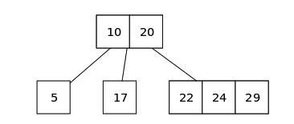

如果一个内部节点拥有1个数据元素,2个子节点,则此节点为2节点,如果一个内部节点拥有2个数据元素,3个子节点,则此节点为3节点,如果一个内部节点拥有3个数据元素,4个子节点,则此节点为4节点.

可以说,所有平衡树的核心都在于插入和删除逻辑.

## `2-3-4`树插入元素
在插入元素时,需要先找到插入的位置,使用二叉查找从上自下查找树节点.

找到插入位置时,将元素插入该位置,然后进行调整,使得满足`2-3-4`树的特征,主要有3种情况:
1. 插入元素到一个2节点或3节点,直接插入即可,这样节点变成3节点或4节点.
2. 插入元素到一个4节点,该4节点的父亲不是一个4节点,将4节点的中间元素提到父亲点,原4节点变成2个2节点,再将元素插入到其中一个2节点.
3. 插入元素到一个4节点,该4节点的父亲时一个4节点,也是将4节点的中间元素提到父亲点,原4节点变成2个2节点,再将元素插入到其中一个2节点,当中间元素提交到父节点时,父节点也是4节点,可以递归向上操作.

核心在于往4节点插入元素时,需要将4节点中间元素提升,4节点变为2个2节点后,再插入元素,如图:
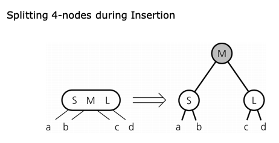

下面演示插入元素到一个4节点:
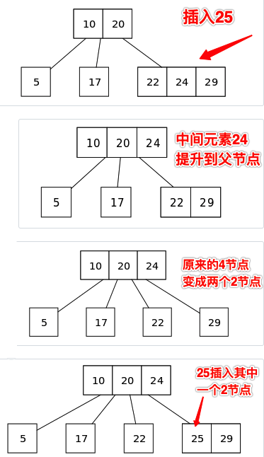

与其他二叉查找树由上而下生长不同,`2-3-4`树是从下至上的生长.`2-3-4`树因为节点元素数量的增加,情况变得更复杂,下面是插入元素到一个4节点,而4节点的父节点是3节点的3种情况:
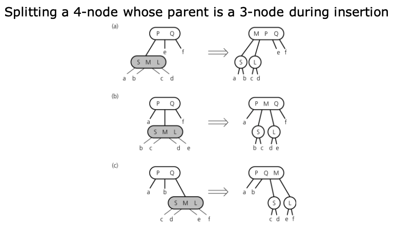

## `2-3-4`树删除元素
`2-3-4`树的特征注定它是一棵非常完美平衡的四叉树,其所有子树也都是完美平衡,所以`2-3-4`树的某节点的儿子,要么都是空儿子,要么都不是空儿子.比如:`2-3-4`树的某个节点A有2个儿子B和C,儿子B和C要么都没有孩子,要么孩子都是满的,不然`2-3-4`树所有叶子节点到根节点的长度一致这个特征就被破坏了.

情况1:删除中间节点
> 删除的是非叶子节点,该节点一定是2棵,3棵或4棵子树的,那么从子树中找到其最小后继节点,该节点是叶子节点,用该节点替换被删除的非叶子节点,然后再删除这个叶子节点,进入情况2.

> 如何找到最小后继节点,当有2棵子树时,那么从右子树一直往左下方找,如果有3棵子树,被删除节点在左边,那么从中子树一直往左下方找,否则从右子树一直往左下方找.如果有4棵子树,那么往被删除节点右边的子树,一直往下方找.

情况2:删除叶子节点
> 删除的是叶子节点,这时叶子节点如果是4节点,直接变为3节点,如果是3节点,那么直接变为2节点即可,不影响平衡.但是,如果叶子节点是2节点,那么删除后,其父节点将会缺失一个儿子,破坏了满孩子的`2-3-4`树特征,需要进行调整后才能删除.

针对情况2,删除一个2节点的叶子节点,会导致父节点缺失一个儿子,破坏了`2-3-4`树的特征,我们可以进行调整变换,主要有2种调整:
1. 重新合并:尝试从兄弟节点那里借值,然后重新调整节点.
2. 合并:如果兄弟借不到值,合并节点

如果被删除的叶子节点有兄弟是3节点或4节点,可以向最近的兄弟借值,然后重新分布,这样叶子节点就不再是2节点了.删除元素后也不会破坏平衡.如图:
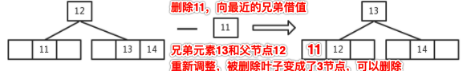

与兄弟借值,兄弟必须有多余的元素可以借,借的过程种需要和父节点元素重新分布位置,确保符合元素大小排序的正确.

如果被删除的叶子节点,兄弟都是2节点,而父亲是3节点或4节点,那么将父节点的一个元素拉下来进行合并,父节点变为2节点或3节点,这时叶子节点就不再是2节点了,删除元素后不会破坏平衡.如图:
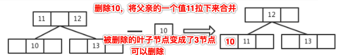

有一种最特殊的情况,也就是被删除的叶子节点,兄弟都是2节点,父亲也是2节点,这种情况没法向兄弟借值,也没法和父亲合并,与父亲合并后父亲就变空了.幸运的是,这种特殊情况只会发生在根节点是其父节点的情况,如图:
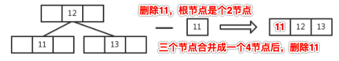

因为`2-3-4`树的性质,除了根节点,其他节点不可能出现其本身和儿子都是2节点.

# 普通红黑树
## 介绍
普通红黑树可以由`2-3-4`树的二叉树形式来实现,其定义为:
1. 根节点的链接是黑色
2. 每个红色节点都必须有2个黑色字节点
3. 任意一个节点达到叶子节点的所有路径,经过的黑链接数量相同,也就是该树是完美黑色平衡树,比如:某一个节点,它可以到达5个叶子节点,那么这5调路径上的黑链接数量一样.

普通红黑树与其变种:左倾红黑树的区别是,它允许右倾的红色节点,不再限制左倾,但仍然不能有连续的2个左倾红色链接.每一棵`2-3-4`树可以对应多课普通红黑树,如图:
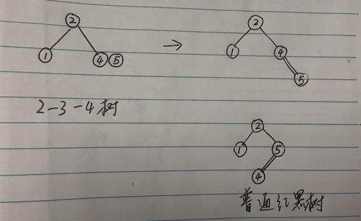

区别:`2-3`树与左倾红黑树则是一一对应,而`2-3-4`树可以对应多棵普通红黑树,是因为它允许了红链接右倾.

## 结构定义和节点旋转
首先,我们定义树的结构`RBTree`,以及表示普通红黑树的节点`RETNode`
```go
// 定义颜色
const (
    RED   = true
    BLACK = false
)
// 普通红黑树
type RBTree struct {
    Root *RBTNode // 树根节点
}
// 新建一棵空树
func NewRBTree() *RBTree {
    return &RBTree{}
}
// 普通红黑树节点
type RBTNode struct {
    Value  int64    // 值
    Times  int64    // 值出现的次数
    Left   *RBTNode // 左子树
    Right  *RBTNode // 右子树
    Parent *RBTNode // 父节点
    Color  bool     // 父亲指向该节点的链接颜色
}
// 节点的颜色
func IsRed(node *RBTNode) bool {
    if node == nil {
        return false
    }
    return node.Color == RED
}
// 返回节点的父亲节点
func ParentOf(node *RBTNode) *RBTNode {
    if node == nil {
        return nil
    }
    return node.Parent
}
// 返回节点的左子节点
func LeftOf(node *RBTNode) *RBTNode {
    if node == nil {
        return nil
    }
    return node.Left
}
// 返回节点的右子节点
func RightOf(node *RBTNode) *RBTNode {
    if node == nil {
        return nil
    }
    return node.Right
}
// 设置节点颜色
func SetColor(node *RBTNode, color bool) {
    if node != nil {
        node.Color = color
    }
}
```

在节点`RBTNode`中,我们存储的元素字段为`Value`由于可能有重复的元素插入,所以多了一个`Times`字段,表示该元素出现几次.

当然,红黑树中的红黑颜色使用`Color`定义,表示父亲指向该节点的链接颜色.

在元素添加和实现的过程中,需要做调整操作,有2种旋转操作,对某节点的右链接进行左旋转,如图:
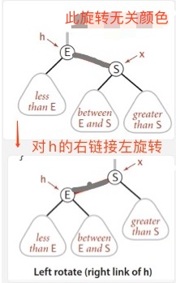

代码如下:
```go
// 对某节点左旋转
func (tree *RBTree) RotateLeft(h *RBTNode) {
    if h != nil {
        // 看图理解
        x := h.Right
        h.Right = x.Left
        if x.Left != nil {
            x.Left.Parent = h
        }
        x.Parent = h.Parent
        if h.Parent == nil {
            tree.Root = x
        } else if h.Parent.Left == h {
            h.Parent.Left = x
        } else {
            h.Parent.Right = x
        }
        x.Left = h
        h.Parent = x
    }
}
```

或者左链接进行右旋转,如图:
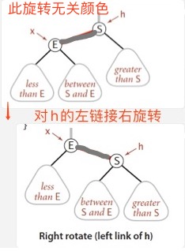

代码如下:
```go
// 对某节点右旋转
func (tree *RBTree) RotateRight(h *RBTNode) {
    if h != nil {
        // 看图理解
        x := h.Left
        h.Left = x.Right
        if x.Right != nil {
            x.Right.Parent = h
        }
        x.Parent = h.Parent
        if h.Parent == nil {
            tree.Root = x
        } else if h.Parent.Right == h {
            h.Parent.Right = x
        } else {
            h.Parent.Left = x
        }
        x.Right = h
        h.Parent = x
    }
}
```

旋转作为局部调整,并不影响全局.

## 添加元素实现
每次添加元素节点时,都将该节点`Color`字段,也就是父亲指向它的链接设置为`RED`红色,总结情况如下:
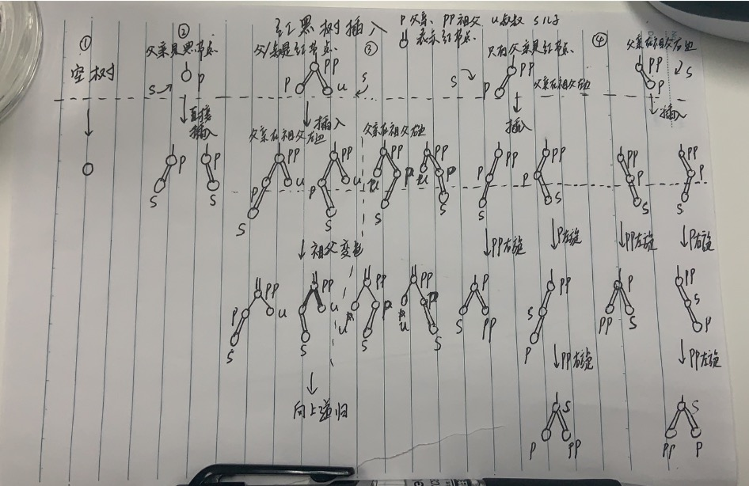

情况1:空树,那么插入节点直接变为根节点

情况2:父节点时黑节点,直接插入即可,不破坏红黑树特征

情况3:父节点是红节点,叔叔节点也是红节点,这时对应`2-3-4`树的4节点,插入节点变成了5节点破坏了平衡,直接将祖父节点变色即可,然后向上递归处理,相当于`2-3-4`树的4节点提升,如图:
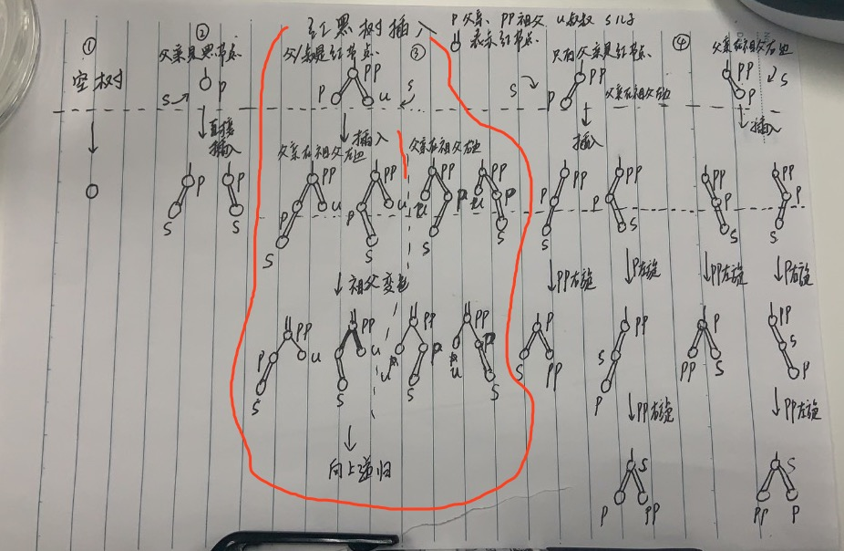

情况4:父节点是红节点,没有叔叔或者叔叔是黑节点,插入后出现了两个连续的红链接,需要进行旋转调整,如图:


如果是顺方向连续红链接,旋转一次即可,否则需要左右旋转或者右左旋转,旋转2次.

这次我们使用非递归的形式,效率会更高,代码实现如下:
```go
// 普通红黑树添加元素
func (tree *RBTree) Add(value int64) {
    // 根节点为空
    if tree.Root == nil {
        // 根节点都是黑色
        tree.Root = &RBTNode{
            Value: value,
            Color: BLACK,
        }
        return
    }
    // 辅助变量 t，表示新元素要插入到该子树，t是该子树的根节点
    t := tree.Root
    // 插入元素后，插入元素的父亲节点
    var parent *RBTNode
    // 辅助变量，为了知道元素最后要插到左边还是右边
    var cmp int64 = 0
    for {
        parent = t
        cmp = value - t.Value
        if cmp < 0 {
            // 比当前节点小，往左子树插入
            t = t.Left
        } else if cmp > 0 {
            // 比当前节点节点大，往右子树插入
            t = t.Right
        } else {
            // 已经存在值了，更新出现的次数
            t.Times = t.Times + 1
            return
        }
        // 终于找到要插入的位置了
        if t == nil {
            break // 这时叶子节点是 parent，要插入到 parent 的下面，跳到外层去
        }
    }
    // 新节点，它要插入到 parent下面
    newNode := &RBTNode{
        Value:  value,
        Parent: parent,
    }
    if cmp < 0 {
        // 知道要从左边插进去
        parent.Left = newNode
    } else {
        // 知道要从右边插进去
        parent.Right = newNode
    }
    // 插入新节点后，可能破坏了红黑树特征，需要修复，核心函数
    tree.fixAfterInsertion(newNode)
}
// 调整新插入的节点，自底而上
// 可以看图理解
func (tree *RBTree) fixAfterInsertion(node *RBTNode) {
    // 插入的新节点一定要是红色
    node.Color = RED
    // 节点不能是空，不能是根节点，父亲的颜色必须为红色（如果是黑色，那么直接插入不破坏平衡，不需要调整了）
    for node != nil && node != tree.Root && node.Parent.Color == RED {
        // 父亲在祖父的左边
        if ParentOf(node) == LeftOf(ParentOf(ParentOf(node))) {
            // 叔叔节点
            uncle := RightOf(ParentOf(ParentOf(node)))
            // 图例3左边部分，叔叔是红节点，祖父变色，也就是父亲和叔叔变黑，祖父变红
            if IsRed(uncle) {
                SetColor(ParentOf(node), BLACK)
                SetColor(uncle, BLACK)
                SetColor(ParentOf(ParentOf(node)), RED)
                // 还要向上递归
                node = ParentOf(ParentOf(node))
            } else {
                // 图例4左边部分，叔叔是黑节点，并且插入的节点在父亲的右边，需要对父亲左旋
                if node == RightOf(ParentOf(node)) {
                    node = ParentOf(node)
                    tree.RotateLeft(node)
                }
                // 变色，并对祖父进行右旋
                SetColor(ParentOf(node), BLACK)
                SetColor(ParentOf(ParentOf(node)), RED)
                tree.RotateRight(ParentOf(ParentOf(node)))
            }
        } else {
            // 父亲在祖父的右边，与父亲在祖父的左边相似
            // 叔叔节点
            uncle := LeftOf(ParentOf(ParentOf(node)))
            // 图例3右边部分，叔叔是红节点，祖父变色，也就是父亲和叔叔变黑，祖父变红
            if IsRed(uncle) {
                SetColor(ParentOf(node), BLACK)
                SetColor(uncle, BLACK)
                SetColor(ParentOf(ParentOf(node)), RED)
                // 还要向上递归
                node = ParentOf(ParentOf(node))
            } else {
                // 图例4右边部分，叔叔是黑节点，并且插入的节点在父亲的左边，需要对父亲右旋
                if node == LeftOf(ParentOf(node)) {
                    node = ParentOf(node)
                    tree.RotateRight(node)
                }
                // 变色，并对祖父进行左旋
                SetColor(ParentOf(node), BLACK)
                SetColor(ParentOf(ParentOf(node)), RED)
                tree.RotateLeft(ParentOf(ParentOf(node)))
            }
        }
    }
    // 根节点永远为黑
    tree.Root.Color = BLACK
}
```

首先,如果是空树,那么新建根节点:
```go
    // 根节点为空
    if tree.Root == nil {
        // 根节点都是黑色
        tree.Root = &RBTNode{
            Value: value,
            Color: BLACK,
        }
        return
    }
```

否则,需要找到叶子节点,方便新节点插进去:
```go
    // 辅助变量 t，表示新元素要插入到该子树，t是该子树的根节点
    t := tree.Root
    // 插入元素后，插入元素的父亲节点
    var parent *RBTNode
    // 辅助变量，为了知道元素最后要插到左边还是右边
    var cmp int64 = 0
    for {
        parent = t
        cmp = value - t.Value
        if cmp < 0 {
            // 比当前节点小，往左子树插入
            t = t.Left
        } else if cmp > 0 {
            // 比当前节点节点大，往右子树插入
            t = t.Right
        } else {
            // 已经存在值了，更新出现的次数
            t.Times = t.Times + 1
            return
        }
        // 终于找到要插入的位置了
        if t == nil {
            break // 这时叶子节点是 parent，要插入到 parent 的下面，跳到外层去
        }
    }
```

找到了要插入的位置,该位置是`parent`,将新元素插入:
```go
    // 新节点，它要插入到 parent下面
    newNode := &RBTNode{
        Value:  value,
        Parent: parent,
    }
    if cmp < 0 {
        // 知道要从左边插进去
        parent.Left = newNode
    } else {
        // 知道要从右边插进去
        parent.Right = newNode
    }
```

插入节点后,就需要进行调整操作了,这时核心:`tree.fixAfterInsertion(newNode)`

参照图对比一下,就可以理解调整操作的逻辑了:
```go
// 调整新插入的节点，自底而上
// 可以看图理解
func (tree *RBTree) fixAfterInsertion(node *RBTNode) {
    // 插入的新节点一定要是红色
    node.Color = RED
    // 节点不能是空，不能是根节点，父亲的颜色必须为红色（如果是黑色，那么直接插入不破坏平衡，不需要调整了）
    for node != nil && node != tree.Root && node.Parent.Color == RED {
        // 父亲在祖父的左边
        if ParentOf(node) == LeftOf(ParentOf(ParentOf(node))) {
            // 叔叔节点
            uncle := RightOf(ParentOf(ParentOf(node)))
            // 图例3左边部分，叔叔是红节点，祖父变色，也就是父亲和叔叔变黑，祖父变红
            if IsRed(uncle) {
                SetColor(ParentOf(node), BLACK)
                SetColor(uncle, BLACK)
                SetColor(ParentOf(ParentOf(node)), RED)
                // 还要向上递归
                node = ParentOf(ParentOf(node))
            } else {
                // 图例4左边部分，叔叔是黑节点，并且插入的节点在父亲的右边，需要对父亲左旋
                if node == RightOf(ParentOf(node)) {
                    node = ParentOf(node)
                    tree.RotateLeft(node)
                }
                // 变色，并对祖父进行右旋
                SetColor(ParentOf(node), BLACK)
                SetColor(ParentOf(ParentOf(node)), RED)
                tree.RotateRight(ParentOf(ParentOf(node)))
            }
        } else {
            // 父亲在祖父的右边，与父亲在祖父的左边相似
            // 叔叔节点
            uncle := LeftOf(ParentOf(ParentOf(node)))
            // 图例3右边部分，叔叔是红节点，祖父变色，也就是父亲和叔叔变黑，祖父变红
            if IsRed(uncle) {
                SetColor(ParentOf(node), BLACK)
                SetColor(uncle, BLACK)
                SetColor(ParentOf(ParentOf(node)), RED)
                // 还要向上递归
                node = ParentOf(ParentOf(node))
            } else {
                // 图例4右边部分，叔叔是黑节点，并且插入的节点在父亲的左边，需要对父亲右旋
                if node == LeftOf(ParentOf(node)) {
                    node = ParentOf(node)
                    tree.RotateRight(node)
                }
                // 变色，并对祖父进行左旋
                SetColor(ParentOf(node), BLACK)
                SetColor(ParentOf(ParentOf(node)), RED)
                tree.RotateLeft(ParentOf(ParentOf(node)))
            }
        }
    }
    // 根节点永远为黑
    tree.Root.Color = BLACK
}
```

可以知道,每次新插入的节点一定是红色:`node.Color = RED`

接着判断:`node != nil && node != tree.Root && node.Parent.Color == RED`发现节点非空,且非根节点,并且其父亲是红色,那么插入新元素到父亲下面就连续2个红链接了,需要调整,否则不需要调整.

调整时要区分父亲是在祖父的左边:`ParentOf(node) == LeftOf(ParentOf(ParentOf(node)))`还是在右边,接着判断叔叔节点`uncle := RightOf(ParentOf(ParentOf(node)))`的颜色.

如果叔叔是红色,对应图例3:


叔叔是红节点,那么祖父变色,也就是父亲和叔叔变黑,祖父变红,然后继续网上递归:
```go
    // 图例3右边部分，叔叔是红节点，祖父变色，也就是父亲和叔叔变黑，祖父变红
    if IsRed(uncle) {
        SetColor(ParentOf(node), BLACK)
        SetColor(uncle, BLACK)
        SetColor(ParentOf(ParentOf(node)), RED)
        // 还要向上递归
        node = ParentOf(ParentOf(node))
    }
```

如果叔叔不是红色,对应图例4:
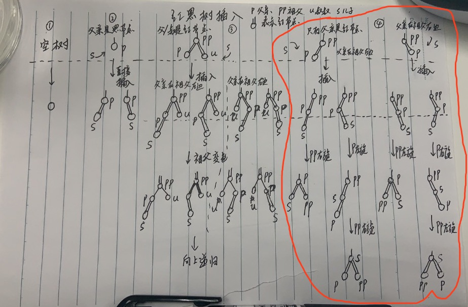

在图例4左边部分,父亲在祖父左边,叔叔是黑节点,如果插入的节点在父亲的右边,需要对父亲左旋,接着祖父变色即可:
```go
    // 图例4左边部分，叔叔是黑节点，并且插入的节点在父亲的右边，需要对父亲左旋
    if node == RightOf(ParentOf(node)) {
        node = ParentOf(node)
        tree.RotateLeft(node)
    }
    // 变色，并对祖父进行右旋
    SetColor(ParentOf(node), BLACK)
    SetColor(ParentOf(ParentOf(node)), RED)
    tree.RotateRight(ParentOf(ParentOf(node)))
```

在图例4右边部分,父亲在祖父右边,叔叔是黑节点,如果插入的节点在父亲的左边,需要对父亲右旋,接着对祖父变色即可:
```go
    // 图例4右边部分，叔叔是黑节点，并且插入的节点在父亲的左边，需要对父亲右旋
    if node == LeftOf(ParentOf(node)) {
        node = ParentOf(node)
        tree.RotateRight(node)
    }
    // 变色，并对祖父进行左旋
    SetColor(ParentOf(node), BLACK)
    SetColor(ParentOf(ParentOf(node)), RED)
    tree.RotateLeft(ParentOf(ParentOf(node)))
```

最后,调整完后,根节点永远为黑:
```go
    // 根节点永远为黑
    tree.Root.Color = BLACK
```

## 添加元素算法分析
当父亲是红节点,叔叔为空或是黑节点时,不需要向上递归,插入最多旋转2次就恢复了平衡,而如果父亲和叔叔都是红节点,那么祖父变色之后可能需要一直递归向上处理,直到根节点,但是只要中途出现了旋转,仍然时旋转2次就不需要继续向上递归,树就平衡了.

最坏情况的红黑树高度`2log(n)`,查找到插入的位置最坏情况查找`2log(n)`次,然后进行调整,最坏情况递归到根节点,递归`2log(n)`次.去掉常数,添加元素的平均时间复杂度仍然为`log(n)`,而旋转最多不超过2次

## 删除元素实现
删除操作就复杂的多,对照`2-3-4`树
1. 如果删除的是非叶子节点,找到其最小后驱节点,也就是在其右子树一直向左找,找到的该叶子节点替换被删除的节点,然后删除该叶子节点
2. 如果删除的是叶子节点,如果它是红节点,也就是父亲指向它的链接为红色,那么直接删除即可.否则,我们需要进行调整使它变为红节点,再删除

针对情况2:如果删除的叶子节点是红节点,那它对应`2-3-4`树的3节点或4节点,直接删除即可,删除后变为2节点或3节点,否则它是一个2节点,删除后破坏了平衡,要么向兄弟借值,要么和父亲的一个元素合并.

删除的叶子节点是黑色的,才需要向兄弟借值,或与父亲合并,有几下几种情况:

删除的叶子节点在父亲的左边:


图例21,22相当于向兄弟借值,而1和23相当于向父亲的一个值合并后调整.

图例1,当删除的叶子节点在父亲左边,而兄弟是红色节点,我们可以直到父亲和兄都儿子们绝对都是黑节点,将兄都变黑,父亲变红,然后对父亲右链接左旋,如图:
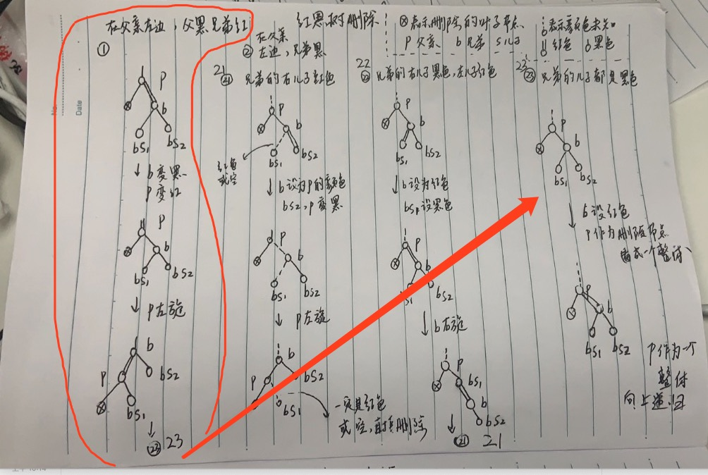

这时调整后变为图例23,这种情况实际上是在`2-3-4`树中和父亲的值合并,只不过将父亲的值转了一个方向,可能变为图例21,22,23

图例23,当删除的叶子节点在父亲左边,兄弟节点是黑色,兄弟的儿子们也都是黑色,相当于`2-3-4`树和兄弟借不到值了,需要将兄弟变为红色,然后将父亲作为一个整体来删除,向上递归处理.如图:
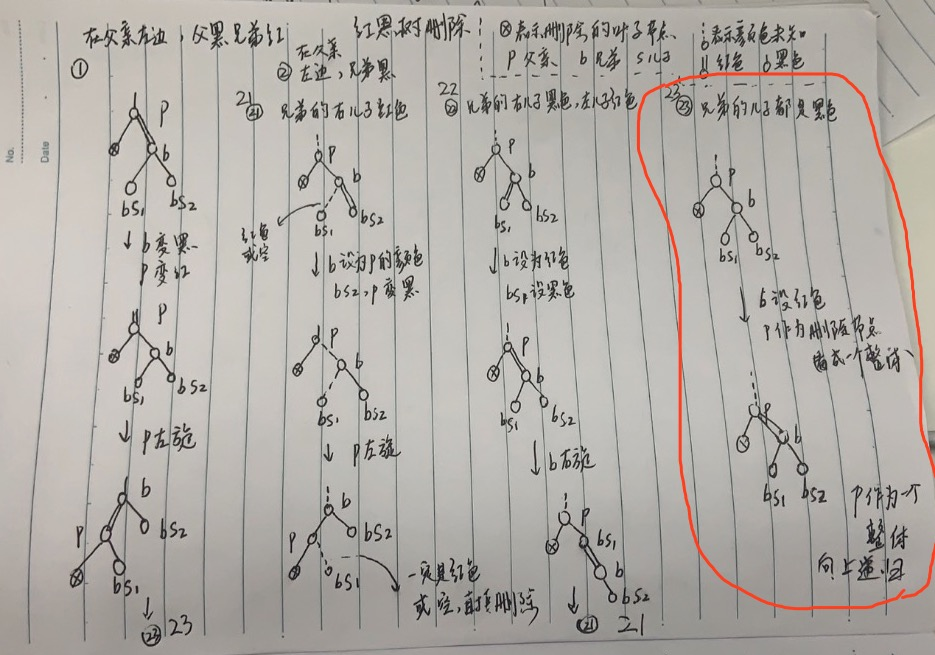

图例21和21就简单了,相当`2-3-4`树与兄弟借值

图例21,当删除的叶子节点在父亲左边,且兄弟是黑色,而兄弟的右儿子是红色,那么兄弟设置成父亲的颜色,兄弟的右儿子和父亲变黑,接着对父亲进行左旋,旋转后可以直接删除元素.如图:
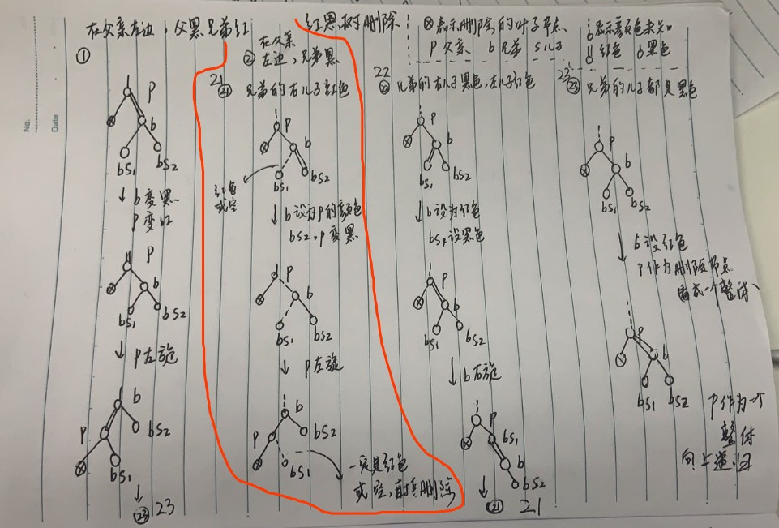

图例22,当删除的叶子节点在父亲左边,且兄弟是黑色,而兄弟的右儿子是黑色,左儿子是红色,将兄弟设置为红色,兄弟的左儿子设置为黑色,对兄弟进行右旋,变为图例21,如图:
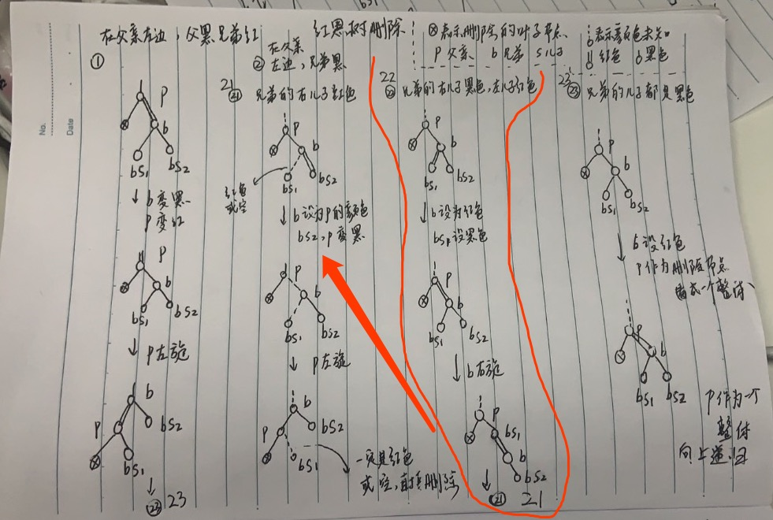

当然,删除的叶子节点可以在父亲的右边:
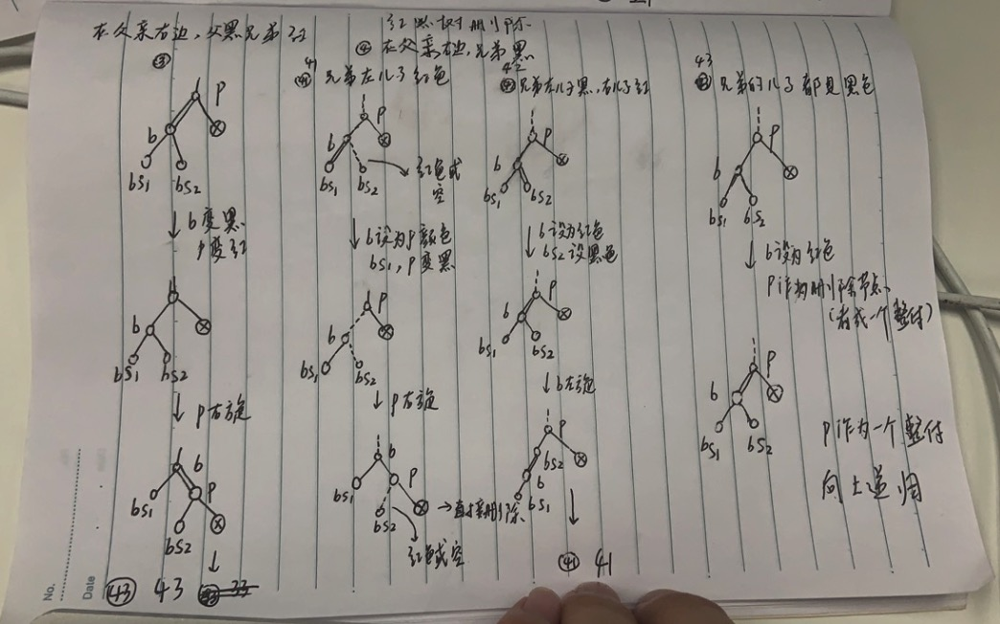

代码实现:
```go
// 普通红黑树删除元素
func (tree *RBTree) Delete(value int64) {
    // 查找元素是否存在，不存在则退出
    p := tree.Find(value)
    if p == nil {
        return
    }
    // 删除该节点
    tree.delete(p)
}
// 删除节点核心函数
// 找最小后驱节点来补位，删除内部节点转为删除叶子节点
func (tree *RBTree) delete(node *RBTNode) {
    // 如果左右子树都存在，那么从右子树的左边一直找一直找，就找能到最小后驱节点
    if node.Left != nil && node.Right != nil {
        s := node.Right
        for s.Left != nil {
            s = s.Left
        }
        // 删除的叶子节点找到了，删除内部节点转为删除叶子节点
        node.Value = s.Value
        node.Times = s.Times
        node = s // 可能存在右儿子
    }
    if node.Left == nil && node.Right == nil {
        // 没有子树，要删除的节点就是叶子节点。
    } else {
        // 只有一棵子树，因为红黑树的特征，该子树就只有一个节点
        // 找到该唯一节点
        replacement := node.Left
        if node.Left == nil {
            replacement = node.Right
        }
        // 替换开始，子树的唯一节点替代被删除的内部节点
        replacement.Parent = node.Parent
        if node.Parent == nil {
            // 要删除的节点的父亲为空，表示要删除的节点为根节点，唯一子节点成为树根
            tree.Root = replacement
        } else if node == node.Parent.Left {
            // 子树的唯一节点替代被删除的内部节点
            node.Parent.Left = replacement
        } else {
            // 子树的唯一节点替代被删除的内部节点
            node.Parent.Right = replacement
        }
        // delete this node
        node.Parent = nil
        node.Right = nil
        node.Left = nil
        //  case 1: not enter this logic
        //      R(del)
        //    B   B
        //
        //  case 2: node's color must be black, and it's son must be red
        //    B(del)     B(del)
        //  R  O       O   R
        //
        // 单子树时删除的节点绝对是黑色的，而其唯一子节点必然是红色的
        // 现在唯一子节点替换了被删除节点，该节点要变为黑色
        // now son replace it's father, just change color to black
        replacement.Color = BLACK
        return
    }
    // 要删除的叶子节点没有父亲，那么它是根节点，直接置空，返回
    if node.Parent == nil {
        tree.Root = nil
        return
    }
    // 要删除的叶子节点，是一个黑节点，删除后会破坏平衡，需要进行调整，调整成可以删除的状态
    if !IsRed(node) {
        // 核心函数
        tree.fixAfterDeletion(node)
    }
    // 现在可以删除叶子节点了
    if node == node.Parent.Left {
        node.Parent.Left = nil
    } else if node == node.Parent.Right {
        node.Parent.Right = nil
    }
    node.Parent = nil
}
// 调整删除的叶子节点，自底向上
// 可以看图理解
func (tree *RBTree) fixAfterDeletion(node *RBTNode) {
    // 如果不是递归到根节点，且节点是黑节点，那么继续递归
    for tree.Root != node && !IsRed(node) {
        // 要删除的节点在父亲左边，对应图例1，2
        if node == LeftOf(ParentOf(node)) {
            // 找出兄弟
            brother := RightOf(ParentOf(node))
            // 兄弟是红色的，对应图例1，那么兄弟变黑，父亲变红，然后对父亲左旋，进入图例21,22,23
            if IsRed(brother) {
                SetColor(brother, BLACK)
                SetColor(ParentOf(node), RED)
                tree.RotateLeft(ParentOf(node))
                brother = RightOf(ParentOf(node)) // 图例1调整后进入图例21,22,23，兄弟此时变了
            }
            // 兄弟是黑色的，对应图例21，22，23
            // 兄弟的左右儿子都是黑色，进入图例23，将兄弟设为红色，父亲所在的子树作为整体，当作删除的节点，继续向上递归
            if !IsRed(LeftOf(brother)) && !IsRed(RightOf(brother)) {
                SetColor(brother, RED)
                node = ParentOf(node)
            } else {
                // 兄弟的右儿子是黑色，进入图例22，将兄弟设为红色，兄弟的左儿子设为黑色，对兄弟右旋，进入图例21
                if !IsRed(RightOf(brother)) {
                    SetColor(LeftOf(brother), BLACK)
                    SetColor(brother, RED)
                    tree.RotateRight(brother)
                    brother = RightOf(ParentOf(node)) // 图例22调整后进入图例21，兄弟此时变了
                }
                // 兄弟的右儿子是红色，进入图例21，将兄弟设置为父亲的颜色，兄弟的右儿子以及父亲变黑，对父亲左旋
                SetColor(brother, ParentOf(node).Color)
                SetColor(ParentOf(node), BLACK)
                SetColor(RightOf(brother), BLACK)
                tree.RotateLeft(ParentOf(node))
                node = tree.Root
            }
        } else {
            // 要删除的节点在父亲右边，对应图例3，4
            // 找出兄弟
            brother := RightOf(ParentOf(node))
            // 兄弟是红色的，对应图例3，那么兄弟变黑，父亲变红，然后对父亲右旋，进入图例41,42,43
            if IsRed(brother) {
                SetColor(brother, BLACK)
                SetColor(ParentOf(node), RED)
                tree.RotateRight(ParentOf(node))
                brother = LeftOf(ParentOf(node)) // 图例3调整后进入图例41,42,43，兄弟此时变了
            }
            // 兄弟是黑色的，对应图例41，42，43
            // 兄弟的左右儿子都是黑色，进入图例43，将兄弟设为红色，父亲所在的子树作为整体，当作删除的节点，继续向上递归
            if !IsRed(LeftOf(brother)) && !IsRed(RightOf(brother)) {
                SetColor(brother, RED)
                node = ParentOf(node)
            } else {
                // 兄弟的左儿子是黑色，进入图例42，将兄弟设为红色，兄弟的右儿子设为黑色，对兄弟左旋，进入图例41
                if !IsRed(LeftOf(brother)) {
                    SetColor(RightOf(brother), BLACK)
                    SetColor(brother, RED)
                    tree.RotateLeft(brother)
                    brother = LeftOf(ParentOf(node)) // 图例42调整后进入图例41，兄弟此时变了
                }
                // 兄弟的左儿子是红色，进入图例41，将兄弟设置为父亲的颜色，兄弟的左儿子以及父亲变黑，对父亲右旋
                SetColor(brother, ParentOf(node).Color)
                SetColor(ParentOf(node), BLACK)
                SetColor(LeftOf(brother), BLACK)
                tree.RotateRight(ParentOf(node))
                node = tree.Root
            }
        }
    }
    // this node always black
    SetColor(node, BLACK)
}
```

首先需要查找删除的值是否存在,不存在则不必要调用删除操作:
```go
// 普通红黑树删除元素
func (tree *RBTree) Delete(value int64) {
    // 查找元素是否存在，不存在则退出
    p := tree.Find(value)
    if p == nil {
        return
    }
    // 删除该节点
    tree.delete(p)
}
```

存在删除的节点,那么进入操作:`tree.delete(p)`

删除操作无非就是找最小后驱节点来补位,删除内部节点转为删除叶子节点,然后针对叶子节点的链接是不是黑色,是的话那么需要调整:
```go
// 删除节点核心函数
// 找最小后驱节点来补位，删除内部节点转为删除叶子节点
func (tree *RBTree) delete(node *RBTNode) {
    // 如果左右子树都存在，那么从右子树的左边一直找一直找，就找能到最小后驱节点
    if node.Left != nil && node.Right != nil {
        s := node.Right
        for s.Left != nil {
            s = s.Left
        }
        // 删除的叶子节点找到了，删除内部节点转为删除叶子节点
        node.Value = s.Value
        node.Times = s.Times
        node = s // 可能存在右儿子
    }
    if node.Left == nil && node.Right == nil {
        // 没有子树，要删除的节点就是叶子节点。
    } else {
        // 只有一棵子树，因为红黑树的特征，该子树就只有一个节点
        // 找到该唯一节点
        replacement := node.Left
        if node.Left == nil {
            replacement = node.Right
        }
        // 替换开始，子树的唯一节点替代被删除的内部节点
        replacement.Parent = node.Parent
        if node.Parent == nil {
            // 要删除的节点的父亲为空，表示要删除的节点为根节点，唯一子节点成为树根
            tree.Root = replacement
        } else if node == node.Parent.Left {
            // 子树的唯一节点替代被删除的内部节点
            node.Parent.Left = replacement
        } else {
            // 子树的唯一节点替代被删除的内部节点
            node.Parent.Right = replacement
        }
        // delete this node
        node.Parent = nil
        node.Right = nil
        node.Left = nil
        //  case 1: not enter this logic
        //      R(del)
        //    B   B
        //
        //  case 2: node's color must be black, and it's son must be red
        //    B(del)     B(del)
        //  R  O       O   R
        //
        // 单子树时删除的节点绝对是黑色的，而其唯一子节点必然是红色的
        // 现在唯一子节点替换了被删除节点，该节点要变为黑色
        // now son replace it's father, just change color to black
        replacement.Color = BLACK
        return
    }
    // 要删除的叶子节点没有父亲，那么它是根节点，直接置空，返回
    if node.Parent == nil {
        tree.Root = nil
        return
    }
    // 要删除的叶子节点，是一个黑节点，删除后会破坏平衡，需要进行调整，调整成可以删除的状态
    if !IsRed(node) {
        // 核心函数
        tree.fixAfterDeletion(node)
    }
    // 现在可以删除叶子节点了
    if node == node.Parent.Left {
        node.Parent.Left = nil
    } else if node == node.Parent.Right {
        node.Parent.Right = nil
    }
    node.Parent = nil
}
```

当删除的节点有2棵子树,那么它是内部节点,找到其最小后驱节点来替换它,也就是其右子树一直往左边找,该最小后驱节点可能是叶子节点,也可能有1个右儿子:
```go
    // 如果左右子树都存在，那么从右子树的左边一直找一直找，就找能到最小后驱节点
    if node.Left != nil && node.Right != nil {
        s := node.Right
        for s.Left != nil {
            s = s.Left
        }
        // 删除的叶子节点找到了，删除内部节点转为删除叶子节点
        node.Value = s.Value
        node.Times = s.Times
        node = s
    }
```

接着判断,如果没有子树,那么删除的节点就是叶子节点:
```go
    if node.Left == nil && node.Right == nil {
        // 没有子树，要删除的节点就是叶子节点。
    }
```

否则如果只有一棵子树,那么根据红黑树的特征,该子树只有一个节点:
```go
    } else {
        // 只有一棵子树，因为红黑树的特征，该子树就只有一个节点
        // 找到该唯一节点
        replacement := node.Left
        if node.Left == nil {
            replacement = node.Right
        }
        // 替换开始，子树的唯一节点替代被删除的内部节点
        replacement.Parent = node.Parent
        if node.Parent == nil {
            // 要删除的节点的父亲为空，表示要删除的节点为根节点，唯一子节点成为树根
            tree.Root = replacement
        } else if node == node.Parent.Left {
            // 子树的唯一节点替代被删除的内部节点
            node.Parent.Left = replacement
        } else {
            // 子树的唯一节点替代被删除的内部节点
            node.Parent.Right = replacement
        }
        // delete this node
        node.Parent = nil
        node.Right = nil
        node.Left = nil
        //  case 1: not enter this logic
        //      R(del)
        //    B   B
        //
        //  case 2: node's color must be black, and it's son must be red
        //    B(del)     B(del)
        //  R  O       O   R
        //
        // 单子树时删除的节点绝对是黑色的，而其唯一子节点必然是红色的
        // 现在唯一子节点替换了被删除节点，该节点要变为黑色
        // now son replace it's father, just change color to black
        replacement.Color = BLACK
        return
    }
```

删除叶子节点,如何删除呢,首先如果它是根节点,那么树就空了:
```go
    // 要删除的叶子节点没有父亲，那么它是根节点，直接置空，返回
    if node.Parent == nil {
        tree.Root = nil
        return
    }
```

否则需要判断该叶子节点是不是红节点,如果不是红节点,不能直接删除,需要调整:
```go
    // 要删除的叶子节点，是一个黑节点，删除后会破坏平衡，需要进行调整，调整成可以删除的状态
    if !IsRed(node) {
        // 核心函数
        tree.fixAfterDeletion(node)
    }
```

最后,就可以删除叶子节点:
```go
    // 现在可以删除叶子节点了
    if node == node.Parent.Left {
        node.Parent.Left = nil
    } else if node == node.Parent.Right {
        node.Parent.Right = nil
    }
    node.Parent = nil
```

核心删除调整函数`fixAfterDeletion`非常重要,看图理解:
```go
// 调整删除的叶子节点，自底向上
// 可以看图理解
func (tree *RBTree) fixAfterDeletion(node *RBTNode) {
    // 如果不是递归到根节点，且节点是黑节点，那么继续递归
    for tree.Root != node && !IsRed(node) {
        // 要删除的节点在父亲左边，对应图例1，2
        if node == LeftOf(ParentOf(node)) {
            // 找出兄弟
            brother := RightOf(ParentOf(node))
            // 兄弟是红色的，对应图例1，那么兄弟变黑，父亲变红，然后对父亲左旋，进入图例21,22,23
            if IsRed(brother) {
                SetColor(brother, BLACK)
                SetColor(ParentOf(node), RED)
                tree.RotateLeft(ParentOf(node))
                brother = RightOf(ParentOf(node)) // 图例1调整后进入图例21,22,23，兄弟此时变了
            }
            // 兄弟是黑色的，对应图例21，22，23
            // 兄弟的左右儿子都是黑色，进入图例23，将兄弟设为红色，父亲所在的子树作为整体，当作删除的节点，继续向上递归
            if !IsRed(LeftOf(brother)) && !IsRed(RightOf(brother)) {
                SetColor(brother, RED)
                node = ParentOf(node)
            } else {
                // 兄弟的右儿子是黑色，进入图例22，将兄弟设为红色，兄弟的左儿子设为黑色，对兄弟右旋，进入图例21
                if !IsRed(RightOf(brother)) {
                    SetColor(LeftOf(brother), BLACK)
                    SetColor(brother, RED)
                    tree.RotateRight(brother)
                    brother = RightOf(ParentOf(node)) // 图例22调整后进入图例21，兄弟此时变了
                }
                // 兄弟的右儿子是红色，进入图例21，将兄弟设置为父亲的颜色，兄弟的右儿子以及父亲变黑，对父亲左旋
                SetColor(brother, ParentOf(node).Color)
                SetColor(ParentOf(node), BLACK)
                SetColor(RightOf(brother), BLACK)
                tree.RotateLeft(ParentOf(node))
                node = tree.Root
            }
        } else {
            // 要删除的节点在父亲右边，对应图例3，4
            // 找出兄弟
            brother := RightOf(ParentOf(node))
            // 兄弟是红色的，对应图例3，那么兄弟变黑，父亲变红，然后对父亲右旋，进入图例41,42,43
            if IsRed(brother) {
                SetColor(brother, BLACK)
                SetColor(ParentOf(node), RED)
                tree.RotateRight(ParentOf(node))
                brother = LeftOf(ParentOf(node)) // 图例3调整后进入图例41,42,43，兄弟此时变了
            }
            // 兄弟是黑色的，对应图例41，42，43
            // 兄弟的左右儿子都是黑色，进入图例43，将兄弟设为红色，父亲所在的子树作为整体，当作删除的节点，继续向上递归
            if !IsRed(LeftOf(brother)) && !IsRed(RightOf(brother)) {
                SetColor(brother, RED)
                node = ParentOf(node)
            } else {
                // 兄弟的左儿子是黑色，进入图例42，将兄弟设为红色，兄弟的右儿子设为黑色，对兄弟左旋，进入图例41
                if !IsRed(LeftOf(brother)) {
                    SetColor(RightOf(brother), BLACK)
                    SetColor(brother, RED)
                    tree.RotateLeft(brother)
                    brother = LeftOf(ParentOf(node)) // 图例42调整后进入图例41，兄弟此时变了
                }
                // 兄弟的左儿子是红色，进入图例41，将兄弟设置为父亲的颜色，兄弟的左儿子以及父亲变黑，对父亲右旋
                SetColor(brother, ParentOf(node).Color)
                SetColor(ParentOf(node), BLACK)
                SetColor(LeftOf(brother), BLACK)
                tree.RotateRight(ParentOf(node))
                node = tree.Root
            }
        }
    }
    // this node always black
    SetColor(node, BLACK)
}
```

只有符合`tree.Root != node && !IsRed(node)`才能继续进入递归

要删除的节点在父亲左边:`node == LeftOf(ParentOf(node))`,对应图例1,2:
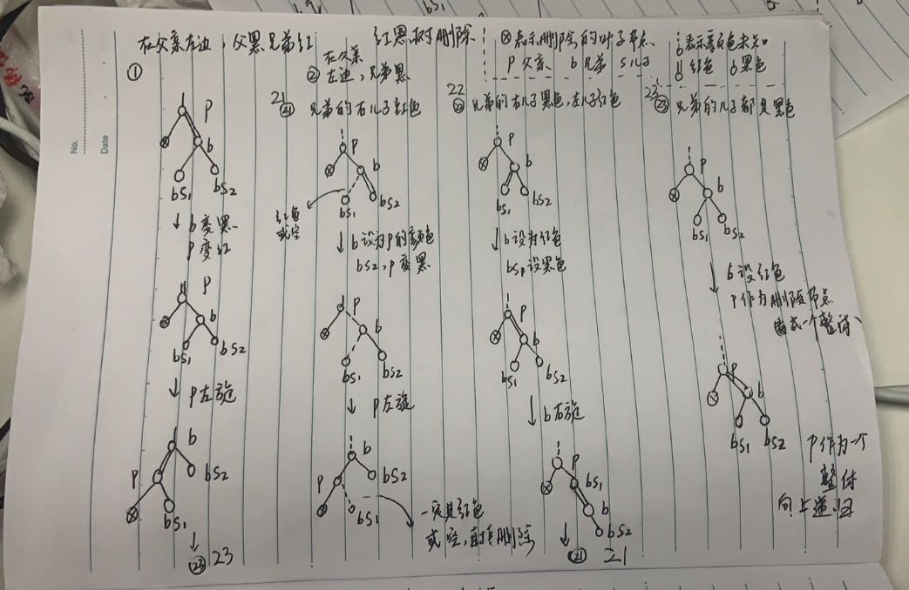

否则对应图例3,4:

## 删除元素算法分析

## 查找元素等实现

## 验证是否是一棵普通红黑树
如何确保我们的代码实现的是一棵普通的红黑树:
```go
// 验证是不是棵红黑树
func (tree *RBTree) IsRBTree() bool {
    if tree == nil || tree.Root == nil {
        return true
    }
    // 判断树是否是一棵二分查找树
    if !tree.Root.IsBST() {
        return false
    }
    // 判断树是否遵循2-3-4树，也就是不能有连续的两个红链接
    if !tree.Root.Is234() {
        return false
    }
    // 判断树是否平衡，也就是任意一个节点到叶子节点，经过的黑色链接数量相同
    // 先计算根节点到最左边叶子节点的黑链接数量
    blackNum := 0
    x := tree.Root
    for x != nil {
        if !IsRed(x) { // 是黑色链接
            blackNum = blackNum + 1
        }
        x = x.Left
    }
    if !tree.Root.IsBalanced(blackNum) {
        return false
    }
    return true
}
// 节点所在的子树是否是一棵二分查找树
func (node *RBTNode) IsBST() bool {
    if node == nil {
        return true
    }
    // 左子树非空，那么根节点必须大于左儿子节点
    if node.Left != nil {
        if node.Value > node.Left.Value {
        } else {
            fmt.Printf("father:%#v,lchild:%#v,rchild:%#v\n", node, node.Left, node.Right)
            return false
        }
    }
    // 右子树非空，那么根节点必须小于右儿子节点
    if node.Right != nil {
        if node.Value < node.Right.Value {
        } else {
            fmt.Printf("father:%#v,lchild:%#v,rchild:%#v\n", node, node.Left, node.Right)
            return false
        }
    }
    // 左子树也要判断是否是平衡查找树
    if !node.Left.IsBST() {
        return false
    }
    // 右子树也要判断是否是平衡查找树
    if !node.Right.IsBST() {
        return false
    }
    return true
}
// 节点所在的子树是否遵循2-3-4树
func (node *RBTNode) Is234() bool {
    if node == nil {
        return true
    }
    // 不允许连续两个左红链接
    if IsRed(node) && IsRed(node.Left) {
        fmt.Printf("father:%#v,lchild:%#v\n", node, node.Left)
        return false
    }
    if IsRed(node) && IsRed(node.Right) {
        fmt.Printf("father:%#v,rchild:%#v\n", node, node.Right)
        return false
    }
    // 左子树也要判断是否遵循2-3-4树
    if !node.Left.Is234() {
        return false
    }
    // 右子树也要判断是否是遵循2-3-4树
    if !node.Right.Is234() {
        return false
    }
    return true
}
// 节点所在的子树是否平衡，是否有 blackNum 个黑链接
func (node *RBTNode) IsBalanced(blackNum int) bool {
    if node == nil {
        return blackNum == 0
    }
    if !IsRed(node) {
        blackNum = blackNum - 1
    }
    if !node.Left.IsBalanced(blackNum) {
        fmt.Println("node.Left to leaf black link is not ", blackNum)
        return false
    }
    if !node.Right.IsBalanced(blackNum) {
        fmt.Println("node.Right to leaf black link is not ", blackNum)
        return false
    }
    return true
}
```

## 完整程序
`RBTree`